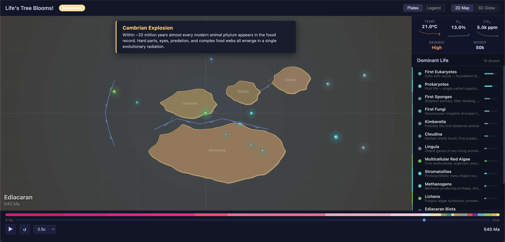
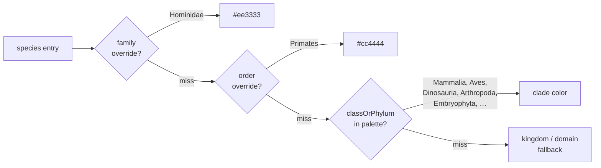
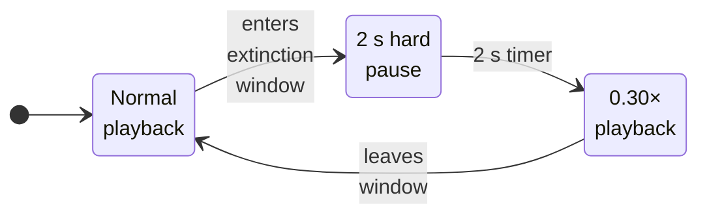
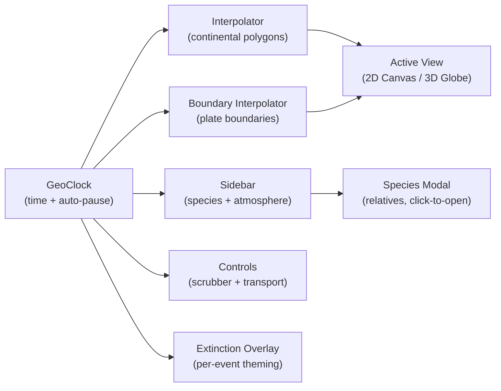

```mermaid
gantt
    title Earth's Geological History (4 Ga → Present)
    dateFormat X
    axisFormat %s

    section Hadean
    Hadean (4.54-4.0 Ga)          :done, 0, 540

    section Archean
    Eoarchean (4.0-3.6 Ga)        :done, 540, 940
    Paleoarchean (3.6-3.2 Ga)     :done, 940, 1340
    Mesoarchean (3.2-2.8 Ga)      :done, 1340, 1740
    Neoarchean (2.8-2.5 Ga)       :done, 1740, 2040

    section Proterozoic
    Paleoproterozoic (2.5-1.6 Ga) :done, 2040, 2940
    Mesoproterozoic (1.6-1.0 Ga)  :done, 2940, 3540
    Neoproterozoic (1.0-539 Ma)   :done, 3540, 4001

    section Phanerozoic
    Paleozoic (539-252 Ma)        :active, 4001, 4288
    Mesozoic (252-66 Ma)          :active, 4288, 4474
    Cenozoic (66 Ma-Present)      :active, 4474, 4540
```

# Life's Tree Blooms!

An interactive animated visualization of Earth's evolutionary history spanning 4 billion years — from the first prokaryotes to modern humans. Continents drift, species rise and fall, mass extinctions reshape the biosphere, and the atmosphere transforms — all rendered in real time across 2D map and 3D globe views.


<br />

<table>
  <tr>
    <td align="center">
      <video src="assets/animations/04-cambrian.webm" autoplay loop muted playsinline width="320">
        
      </video><br/>
      <sub><b>Cambrian Explosion</b> — 540 → 480 Ma · <a href="docs/sequences/cambrian.md">walkthrough</a></sub>
    </td>
    <td align="center">
      <video src="assets/animations/09-kpg.webm" autoplay loop muted playsinline width="320">
        
      </video><br/>
      <sub><b>K-Pg Asteroid Impact</b> — 67 → 64 Ma · <a href="docs/sequences/kpg.md">walkthrough</a></sub>
    </td>
    <td align="center">
      <video src="assets/animations/10-pleistocene.webm" autoplay loop muted playsinline width="320">
        
      </video><br/>
      <sub><b>Ice Age & Megafauna</b> — 2.5 → 0.012 Ma · <a href="docs/sequences/pleistocene.md">walkthrough</a></sub>
    </td>
  </tr>
</table>

> **Note:** Hero clips are generated by the [capture pipeline](scripts/capture/README.md). On a fresh clone they may be absent — run `node scripts/capture/capture.js --all` to populate them, or browse the live app and use the [notable-sequences guide](docs/notable-sequences.md) as a viewing schedule.

## Quickstart

No build step, no dependencies to install. Serve the project with any static HTTP server:

```bash
python3 -m http.server 8080
# or:  npx serve
```

Then open <http://localhost:8080> in a modern browser. A full play-through at 1× takes about **4 minutes 27 seconds**.

## Featured sequences

Eleven moments worth pausing on, each with a dedicated walkthrough.

| # | Time (Ma) | Sequence | What to watch |
|---|-----------|----------|---------------|
| 1 | 4540 → 4000 | [Earth's Origin & Hadean](docs/sequences/hadean.md) | Molten newborn planet, no continents, no life |
| 2 | 2500 → 2200 | [Great Oxygenation Event](docs/sequences/goe.md) | Cyanobacteria peak, methane haze clears, atmosphere flips |
| 3 | 720 → 635 | [Snowball Earth](docs/sequences/snowball.md) | Polar ice caps reach the equator |
| 4 | 540 → 480 | [Cambrian Explosion](docs/sequences/cambrian.md) | Body plans burst — sidebar fills with new categories |
| 5 | 410 → 360 | [First Forests (Devonian)](docs/sequences/forests.md) | Land turns green, fish crawl out, O₂ surges |
| 6 | 256 → 250 | [End-Permian "Great Dying"](docs/sequences/permian.md) | 96% of species lost; clock pauses on the overlay |
| 7 | 200 → 145 | [Jurassic Dinosaurs](docs/sequences/jurassic.md) | Pangaea splits, peak dinosaur diversity |
| 8 | 165 → 65 | [Feathered Dinosaurs & Dawn of Birds](docs/sequences/feathered.md) | Tianyulong, Yi qi, Yutyrannus, Wulong, Asteriornis — much of it discovered post-2010 |
| 9 | 67 → 64 | [K-Pg Asteroid Impact](docs/sequences/kpg.md) | Asteroid streak across the sky, dinosaurs vanish |
| 10 | 2.5 → 0.012 | [Ice Age & Megafauna](docs/sequences/pleistocene.md) | Ice caps advance, mammoths and dire wolves dominate |
| 11 | 6 → 0 | [Hominin Emergence](docs/sequences/hominin.md) | Sahelanthropus → Australopithecus → erectus → Neanderthal/Denisovan/naledi/sapiens |

<p align="center">
  <a href="docs/sequences/hadean.md"></a>
  <a href="docs/sequences/goe.md"></a>
  <a href="docs/sequences/snowball.md"></a>
  <a href="docs/sequences/cambrian.md"></a>
  <a href="docs/sequences/forests.md"></a>
  <a href="docs/sequences/permian.md"></a>
  <a href="docs/sequences/jurassic.md"></a>
  <a href="docs/sequences/feathered.md"></a>
  <a href="docs/sequences/kpg.md"></a>
  <a href="docs/sequences/pleistocene.md"></a>
  <a href="docs/sequences/hominin.md"></a>
</p>

The full index lives in **[docs/notable-sequences.md](docs/notable-sequences.md)**.

## Features

### Continental drift

Twelve historically reconstructed continental configurations morph smoothly across geological time, from proto-cratons through supercontinents to today's familiar landmasses:

| Time (Ma) | Configuration |
|-----------|---------------|
| 4,000 | Two proto-cratons (Vaalbara, Ur) |
| 2,700 | Kenorland supercontinent |
| 1,100 | Rodinia assembled |
| 750 | Rodinia fragmenting into four blocks |
| 540 | Gondwana + Laurentia, Baltica, Siberia |
| 430 | Ordovician arrangement |
| 300 | Pangaea assembling |
| 250 | Pangaea complete |
| 150 | Laurasia + Gondwana |
| 66 | Seven continents (K-Pg boundary) |
| 20 | Near-modern arrangement |
| 0 | Present day |

Coastlines are rendered with **deterministic fractal subdivision** plus **smooth Bézier interpolation** — the fractal detail stays consistent across frames, while quadratic curves through midpoints make the shorelines flow rather than zig-zag. A subtle NW-lit highlight + SE shadow inside each continent gives a hint of relief without any heightmap data.

### Species & evolution

**155 species** are tracked across geological time, each with an **abundance profile** that rises and falls over millions of years. The sidebar ranks the most dominant life forms at any given moment, from Archean prokaryotes to *Homo sapiens* — including a recent batch of post-2010 paleontological discoveries (Patagotitan, Yi qi, the "Wonderchicken" Asteriornis, Homo naledi, Cambroraster, Ourasphaira, and many more).

Every species carries a full Linnaean lineage — domain → kingdom → class/phylum → order → family → genus → species — and that lineage drives the whole UI:

- **Marker color** is derived from `taxonomy.classOrPhylum` with order/family-level overrides, not from a flat category label, so convergent forms (e.g. pterosaurs and plesiosaurs) stay visually distinct.
- **Species modal** shows the full 7-rank ladder with the entry's own rank highlighted.
- **Hover popup** shows a compact `Eukarya › Animalia › Mammalia › Primates › Hominidae › Homo › sapiens` breadcrumb.
- **Legend panel** turns into a live tree of currently-alive species grouped by domain → kingdom → class/phylum.
- **Close relatives** in the modal are scored by shared-rank depth (genus > family > order > … > domain), so Homo sapiens surfaces Homo erectus and Neanderthals first, and a pterosaur no longer lists living lizards as "relatives".

Species appear as pulsing color-coded markers at their geographic origins — each with a soft radial halo, and a rim ring on mammals and birds resolved to order level or deeper. **Click any species in the sidebar** (or in the legend tree) to open a detail modal that pauses the animation and lists its closest evolutionary relatives.

<details>
<summary><b>How the color lookup works</b></summary>



Override entries live in `COLORS.cladeOverride`; clade entries in `COLORS.clade`. Both in `js/config.js`.

</details>

### Mass extinctions

The Big Five mass extinction events trigger dramatic, per-event visual treatments:

| Event | Time (Ma) | Lost | Cause |
|-------|-----------|------|-------|
| End-Ordovician | 443.8 | 86% | Gondwana glaciation, sea-level drop |
| Late Devonian | 372 | 75% | Ocean anoxia, volcanic activity |
| End-Permian — *The Great Dying* | 251.9 | 96% | Siberian Traps volcanism, runaway greenhouse |
| End-Triassic | 201.4 | 80% | Central Atlantic Magmatic Province eruptions |
| End-Cretaceous — *K-Pg Event* | 66 | 76% | Chicxulub asteroid + Deccan Traps |

When an extinction begins:

- The clock **hard-pauses for 2 real seconds** so the overlay text is readable.
- The overlay re-skins itself in the event's signature color (red for Permian, blue for Ordovician, orange for K-Pg, etc.) — text glow, vignette background, and subtitle tint all derive from `extinction.color`.
- The 2D extinction flash uses the same signature color rather than always-red.
- The K-Pg event additionally renders a **bright diagonal asteroid streak** across the canvas during its first 18% of progress.
- The 3D ocean tints toward a muted version of the event color.
- The viewport shakes proportional to severity, and after the pause playback resumes at 30% speed for the rest of the event window.



See [docs/architecture.md](docs/architecture.md#extinction-auto-pause-state-machine) for the full state machine including manual overrides and scrub behavior.

### Tectonic plate boundaries

Toggle the **Plates** overlay to see tectonic plate boundaries evolve through time. Three boundary types are distinguished visually:

- **Divergent** (orange-red, dashed) — spreading ridges where plates move apart (Mid-Atlantic Ridge, East African Rift)
- **Convergent** (blue, solid with teeth) — subduction zones and collision belts (Ring of Fire, Himalayas)
- **Transform** (yellow-green, dotted) — strike-slip faults (San Andreas)

Boundaries interpolate between time slices like the continents, showing the opening and closing of oceans, supercontinent assembly and breakup, and the evolution of subduction zones.

### Atmosphere & environment

The sidebar displays five real-time environmental indicators, interpolated from paleoclimate data:

| Indicator | Range | Notable extremes |
|-----------|-------|------------------|
| **Temperature** | -5 °C → 70 °C | Snowball Earth (-5 °C), Hadean magma ocean (70 °C), PETM spike (24 °C) |
| **O₂** | 0% → 32% | Great Oxygenation Event (2.4 Ga), Carboniferous peak (32%) |
| **CO₂** | 280 ppm → 100,000 ppm | Early atmosphere (100 k ppm), Carboniferous minimum (300 ppm) |
| **Seismic** | Low → Extreme | Hadean (Extreme), Boring Billion (Low), Pangaea breakup (High) |
| **Biodiversity** | thousands of species | Cambrian onset, Pleistocene megafauna peak |

Temperature, O₂, and CO₂ readouts include sparklines tracking the curve around the current time.

### Temporal compression

Not all geological time gets the same screen time. Each period in `js/data/timeline.js` has a `temporalWeight` that scales how slowly the clock advances — billions of years of single-celled stability pass quickly, while diversification bursts linger. The `clock.tick(delta)` multiplies the raw delta by the current period's weight before advancing `currentTimeMa`.

All 26 periods, sorted by weight (low = flies by, high = lingers):

| Period | Window (Ma) | Weight | Bar |
|---|---|--:|---|
| Hadean | 4540 → 4000 | 0.10 | ▏ |
| Eoarchean | 4000 → 3600 | 0.20 | ▎ |
| Paleoarchean | 3600 → 3200 | 0.30 | ▍ |
| Mesoarchean | 3200 → 2800 | 0.20 | ▎ |
| Neoarchean | 2800 → 2500 | 0.35 | ▍ |
| Paleoproterozoic (GOE) | 2500 → 1600 | 0.45 | ▌ |
| Mesoproterozoic | 1600 → 1000 | 0.35 | ▍ |
| Cryogenian | 1000 → 720 | 0.45 | ▌ |
| Cryogenian-Snowball | 720 → 635 | 1.00 | █ |
| Ediacaran | 635 → 538.8 | 2.50 | ██▌ |
| Cambrian | 538.8 → 485.4 | 5.50 | █████▌ |
| Ordovician | 485.4 → 443.8 | 4.00 | ████ |
| Silurian | 443.8 → 419.2 | 3.50 | ███▌ |
| Devonian | 419.2 → 358.9 | 5.00 | █████ |
| Carboniferous | 358.9 → 298.9 | 4.00 | ████ |
| Permian | 298.9 → 251.9 | 3.20 | ███▏ |
| Triassic | 251.9 → 201.4 | 4.00 | ████ |
| Jurassic | 201.4 → 145 | 5.50 | █████▌ |
| Cretaceous | 145 → 66 | 5.50 | █████▌ |
| Paleocene | 66 → 56 | 3.00 | ███ |
| Eocene | 56 → 34 | 4.50 | ████▌ |
| Oligocene | 34 → 23 | 3.00 | ███ |
| Miocene | 23 → 5.333 | 6.00 | ██████ |
| Pliocene | 5.333 → 2.58 | 5.00 | █████ |
| **Pleistocene** | 2.58 → 0.0117 | **10.00** | ██████████ |
| Holocene | 0.0117 → 0 | 5.00 | █████ |

Total play-through at 1× speed: ~**4 min 27 s**. The speed selector ranges 0.25× → 4×.

Each Big Five extinction adds a **2-second hard pause on entry** plus a 0.30× slowdown for the rest of the window, compounded onto the period weight.

### Views

#### 2D map

Flat equirectangular projection with a depth-graded ocean, climate-zone graticule (emphasized equator + dashed tropics + polar circles), continental polygons with smooth Bézier coastlines and shaded relief, and pulsing species markers. Pan by dragging, zoom with the wheel.

#### 3D globe

Interactive Three.js globe with elevated continental shelves, side-wall shading, auto-rotation, day/night terminator, and a 2,000-star background. Polished with **Fresnel rim-glow atmosphere shader** (additive blending), a slow-drifting **procedural cloud shell**, brighter ocean specular for sun glints, and ACES Filmic tone mapping. The globe is lazy-loaded on first toggle.

Both views share the same timeline state — switching preserves time and playback.

## Controls

| Control | Action |
|---------|--------|
| **Play/Pause button** · **Space** | Start or pause the animation |
| **Timeline scrubber** | Drag to jump to any point in geological time (left = past, right = present) |
| **Right arrow** | Step 20 Ma toward the present |
| **Left arrow** | Step 20 Ma toward the past |
| **Speed selector** | 0.25× → 4× |
| **Restart** · **R** | Return to 4 billion years ago |
| **Plates** · **P** | Toggle plate-boundary overlay |
| **2D Map** / **3D Globe** | Switch between flat map and globe views |
| **Click a sidebar species** | Open detail modal with close evolutionary relatives (auto-pauses) |
| **Hover a species marker or sidebar item** | Show quick-info popup |

The colored era strip above the scrubber shows geological periods at a glance, using standard ICS colors.

## Architecture



A single `requestAnimationFrame` loop in `main.js` drives everything. The clock advances time, interpolators produce geometry, all views and UI components re-render each frame. See **[docs/architecture.md](docs/architecture.md)** for the full module map and data-flow details.

## Geological timeline



## Documentation

- **[docs/notable-sequences.md](docs/notable-sequences.md)** — index of the 10 featured sequences with thumbnails
- **[docs/architecture.md](docs/architecture.md)** — module map, render pipeline, capture pipeline
- **[docs/data-sources.md](docs/data-sources.md)** — paleo data references for continents, atmosphere, extinctions
- **[docs/capture.md](docs/capture.md)** — how to regenerate the embedded screenshots and animated clips
- **[scripts/capture/README.md](scripts/capture/README.md)** — Playwright + ffmpeg capture pipeline reference

## Tech stack

Vanilla HTML / CSS / ES modules. No bundler. No framework. No npm dependencies for the runtime — Three.js v0.170.0 is loaded via CDN import map. The only Node dependency is **Playwright**, used exclusively by the optional capture pipeline (`scripts/capture/`).
