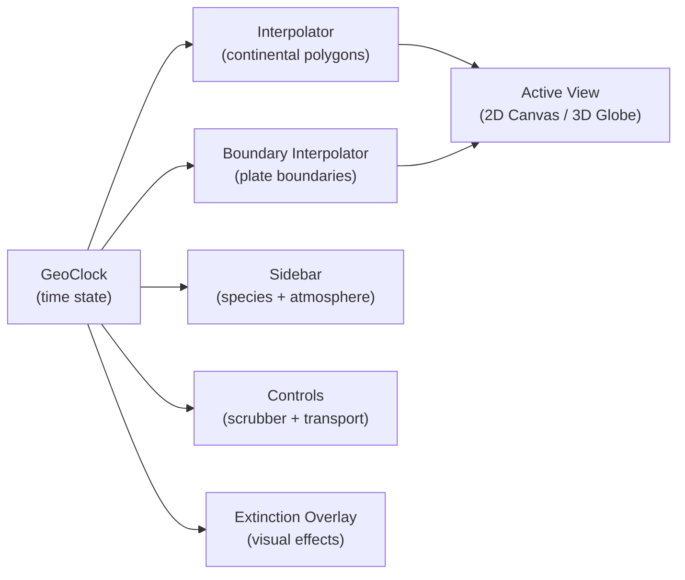

# Life's Tree Blooms!

An interactive animated visualization of Earth's evolutionary history spanning 4 billion years — from the first prokaryotes to modern humans. Watch continents drift, species rise and fall, mass extinctions reshape life, and the atmosphere transform — all rendered in real time across two view modes.

## Features

### Continental Drift

Twelve historically reconstructed continental configurations morph smoothly across geological time, from proto-cratons through supercontinents to today's familiar landmasses:

| Time (Ma) | Configuration |
|-----------|---------------|
| 4,000 | Two proto-cratons (Vaalbara, Ur) |
| 2,700 | Kenorland supercontinent |
| 1,100 | Rodinia assembled |
| 750 | Rodinia fragmenting into four blocks |
| 540 | Gondwana + Laurentia, Baltica, Siberia |
| 430 | Ordovician arrangement |
| 300 | Pangaea assembling |
| 250 | Pangaea complete |
| 150 | Laurasia + Gondwana |
| 66 | Seven continents (K-Pg boundary) |
| 20 | Near-modern arrangement |
| 0 | Present day |

Continents are rendered with **fractal coastlines** — deterministic midpoint-displacement subdivision that adds realistic coastal roughness without animation jitter. The fractal detail is consistent across frames thanks to coordinate-based hashing.

### Species & Evolution

56 species and major events are tracked across geological time, each with an **abundance profile** that rises and falls over millions of years. The sidebar ranks the most dominant life forms at any given moment, from Archean prokaryotes to Homo sapiens.

Categories span the tree of life: prokaryotes, bacteria, eukaryotes, plants, invertebrates, arthropods, fish, amphibians, reptiles, synapsids, mammals, birds, primates, and hominins. Five milestone events are also tracked (Great Oxygenation Event, Snowball Earth, Cambrian Explosion, Mammalian Radiation, Agriculture & Civilization).

Species appear as pulsing color-coded markers at their geographic origins on the map.

### Mass Extinctions

The Big Five mass extinction events trigger dramatic visual effects:

| Event | Time (Ma) | Species Lost | Cause |
|-------|-----------|-------------|-------|
| End-Ordovician | 443.8 | 86% | Gondwana glaciation, sea level drop |
| Late Devonian | 372 | 75% | Ocean anoxia, volcanic activity |
| End-Permian ("The Great Dying") | 251.9 | 96% | Siberian Traps volcanism, ocean anoxia |
| End-Triassic | 201.4 | 80% | Central Atlantic Magmatic Province volcanism |
| End-Cretaceous ("K-Pg Event") | 66 | 76% | Chicxulub asteroid + Deccan Traps |

During each event: the ocean shifts red, a translucent flash overlays the viewport, the screen shakes proportional to severity, event details appear as centered text, and **playback slows to 30%** so you can watch the devastation unfold.

### Tectonic Plate Boundaries

Toggle the **Plates** overlay to see tectonic plate boundaries evolve through time. Three boundary types are distinguished visually:

- **Divergent** (orange-red, dashed) — spreading ridges where plates move apart (Mid-Atlantic Ridge, East African Rift)
- **Convergent** (blue, solid with teeth) — subduction zones and collision belts (Ring of Fire, Himalayas)
- **Transform** (yellow-green, dotted) — strike-slip faults (San Andreas)

Boundaries interpolate between time slices just like continents, showing the opening and closing of oceans, assembly and breakup of supercontinents, and the evolution of subduction zones.

### Atmosphere & Environment

The sidebar displays four real-time environmental indicators, interpolated from paleoclimate data:

| Indicator | Range | Notable Events |
|-----------|-------|----------------|
| **Temperature** | -5°C to 70°C | Snowball Earth (-5°C), Hadean magma ocean (70°C), PETM spike (24°C) |
| **O₂** | 0% to 32% | Great Oxygenation Event (2.4 Ga), Carboniferous peak (32%) |
| **CO₂** | 280 ppm to 100,000 ppm | Early atmosphere (100k ppm), Carboniferous minimum (300 ppm) |
| **Seismic Activity** | Low to Extreme | Hadean (Extreme), Boring Billion (Low), Pangaea breakup (High) |

The seismic indicator reflects plate tectonic intensity — high during supercontinent assembly/breakup, low during stable periods.

### Temporal Compression

Not all geological time is created equal. The animation uses **temporal weighting** so that billions of years of single-celled life pass quickly, while periods of rapid diversification linger:

- **Hadean** (0.05x) — flies by in seconds
- **Boring Billion** (0.15x) — compressed stability
- **Cambrian** (3x) — explosion of multicellular life gets extended screen time
- **Cretaceous** (2.5x) — dinosaur dominance plays out slowly
- **Quaternary** (12x) — human evolution and ice ages in full detail

Extinction events add an additional 0.3x slowdown on top of the period weight.

## Views

### 2D Map (default)

Flat equirectangular projection with ocean depth gradient, 30° coordinate grid, continental polygons with fractal coastlines, and species markers. Pan by dragging, zoom with the scroll wheel.

### 3D Globe

Interactive Three.js globe with elevated continental shelves, side-wall shading, auto-rotation, directional lighting, and a 2,000-star background. Orbit by dragging, zoom with scroll. The globe is lazy-loaded on first toggle to keep initial load fast.

Both views share the same timeline state — switching preserves the current time and playback.

## Controls

| Control | Action |
|---------|--------|
| **Play/Pause button** | Start or pause the animation |
| **Spacebar** | Toggle play/pause |
| **Timeline scrubber** | Drag to jump to any point in geological time |
| **Left/Right arrows** | Step backward/forward 20 Ma |
| **Speed selector** | Adjust playback speed (0.25x to 4x) |
| **Restart button** | Return to 4 billion years ago |
| **R key** | Restart the animation |
| **P key** | Toggle plate boundary overlay |
| **Plates button** | Toggle plate boundary overlay |
| **2D Map / 3D Globe** | Switch between flat map and globe views |

The colored era strip above the scrubber shows geological periods at a glance, using standard International Commission on Stratigraphy (ICS) colors.

## Architecture



A single `requestAnimationFrame` loop in `main.js` drives everything. The clock advances time, interpolators produce geometry, and all views and UI components update each frame.

## Geological Timeline

```mermaid
gantt
    title Earth's Geological History (4 Ga → Present)
    dateFormat X
    axisFormat %s

    section Hadean
    Hadean (4.54-4.0 Ga)          :done, 0, 540

    section Archean
    Eoarchean (4.0-3.6 Ga)        :done, 540, 940
    Paleoarchean (3.6-3.2 Ga)     :done, 940, 1340
    Mesoarchean (3.2-2.8 Ga)      :done, 1340, 1740
    Neoarchean (2.8-2.5 Ga)       :done, 1740, 2040

    section Proterozoic
    Paleoproterozoic (2.5-1.6 Ga) :done, 2040, 2940
    Mesoproterozoic (1.6-1.0 Ga)  :done, 2940, 3540
    Neoproterozoic (1.0-539 Ma)   :done, 3540, 4001

    section Phanerozoic
    Paleozoic (539-252 Ma)        :active, 4001, 4288
    Mesozoic (252-66 Ma)          :active, 4288, 4474
    Cenozoic (66 Ma-Present)      :active, 4474, 4540
```



## Running

No build step or installation required. Serve the project with any static HTTP server:

```
python3 -m http.server 8080
```

Then open http://localhost:8080 in a modern browser (Chrome, Firefox, Safari, or Edge).

Alternatively, use Node.js:

```
npx serve
```
