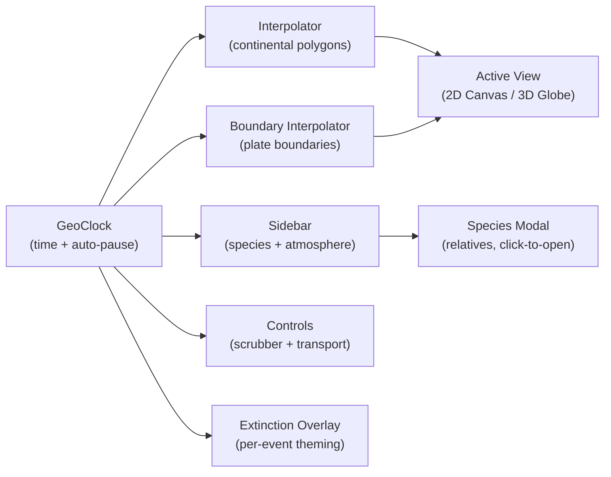

# Architecture

Vanilla HTML / CSS / ES modules. Three.js v0.170.0 loaded via CDN import map in `index.html`. No bundler. No framework. No npm dependencies for the runtime.

## Data flow



A single `requestAnimationFrame` loop in `js/main.js` drives the system. Each frame:

1. `clock.tick(delta)` advances `currentTimeMa` (downward, since time runs from past → present).
2. `getPolygonsAtTime(t)` and `getBoundariesAtTime(t)` return interpolated geometry.
3. The active view (`View2D` or `View3D`) renders the scene.
4. `Sidebar`, `Controls`, `ExtinctionOverlay`, and `MilestoneOverlay` update their DOM from `t`.

## Modules

### Engine

| Module | Responsibility |
|---|---|
| `js/engine/clock.js` | Time progression with temporal compression. Implements the **2-second extinction auto-pause**: edge-detects entry into a Big Five window and triggers `_triggerExtinctionPause()`. Exposes `onPlayingChange` callback so external UI stays in sync. |
| `js/engine/interpolator.js` | Continental polygons between 12 time slices, with split/merge via centroid collapse/expand. |
| `js/engine/plateBoundaryInterpolator.js` | Plate-boundary polylines between matching slices. |
| `js/engine/fractal.js` | Deterministic fractal coastline subdivision with coordinate-based hashing — no jitter during interpolation. |

### Views

| Module | Highlights |
|---|---|
| `js/views/view2d.js` | Smooth Bézier coastlines (`_tracePath()`), shaded relief (NW highlight + SE shadow clipped inside each polygon), enhanced graticule (emphasized equator/prime meridian + dashed tropics & polar circles), per-event extinction flash, K-Pg asteroid streak, marker halos with rim ring on advanced clades. |
| `js/views/view3d.js` | ACES Filmic tone mapping, MeshPhongMaterial with bright specular for sun glints, **Fresnel rim-glow atmosphere** (custom `ShaderMaterial`, additive blending), **procedural cloud shell** generated by `_buildCloudTexture()`, per-event ocean tint, additive marker halos. Lazy-loaded on first 3D toggle. |

### UI

| Module | Responsibility |
|---|---|
| `js/ui/sidebar.js` | Species list ranked by abundance + 5 atmosphere readouts (Temp, O₂, CO₂ with sparklines, Seismic, Biodiversity). Click hands off to `SpeciesModal`. |
| `js/ui/speciesModal.js` | Centered modal that pauses the clock on open, shows full detail, and lists "close relatives" computed by category + temporal overlap/proximity. Stays paused on close. |
| `js/ui/speciesPopup.js` | Hover-anchored quick-info card. |
| `js/ui/controls.js` | Scrubber, play/pause, speed, restart, era strip, keyboard shortcuts. The scrubber inverts `clock.currentTimeMa` so left = past, right = present. Exposes `syncPlayButton()`. |
| `js/ui/extinctionOverlay.js` | Per-event theming: title color/glow, vignette gradient, subtitle color all derived from `extinction.color`. |
| `js/ui/milestoneOverlay.js` | Lighter top-center callouts for non-extinction milestones. |
| `js/ui/legend.js` | Toggleable category-color legend. |

### Data

| Module | Content |
|---|---|
| `js/data/timeline.js` | 26 geological periods with ICS colors and `temporalWeight` values |
| `js/data/continents.js` | 12 continental polygon time slices |
| `js/data/species.js` | 119 species and milestone events with abundance profiles |
| `js/data/extinctions.js` | The Big Five with timing, severity, cause, signature color |
| `js/data/atmosphere.js` | Temperature, O₂, CO₂ curves |
| `js/data/seismicActivity.js` | Plate-tectonic intensity curve |
| `js/data/biodiversity.js` | Estimated species count helper |
| `js/data/glaciation.js` | Polar ice-cap extent driven by temperature |

See [docs/data-sources.md](data-sources.md) for the paleo references behind these.

### Utilities

- `js/util/colorMix.js` — `hexToRgb`, `mixColors`, `mixColorsRgba`, `clamp`
- `js/util/atmoVisual.js` — atmosphere snapshot → haze tint + latitude-keyed continent color sample

### Configuration

`js/config.js` holds every tunable constant: kingdom colors, timing (base speed, slowdowns, the 2-second pause), render parameters (fractal depth, marker sizes, globe radius, etc.), layout, atmosphere haze parameters, glaciation thresholds, and latitude-color palette.

## Capture pipeline

The screenshots and animated clips embedded in the README and `docs/sequences/` are produced by Playwright + ffmpeg.

```
scripts/capture/
├── package.json    # Playwright dev-dep
├── sequences.js    # 10-sequence catalog
├── capture.js      # CLI: node capture.js [--all | <ids>]
└── README.md       # full pipeline docs
```

Capture mode is activated by appending `?capture=1` to the URL. See `js/capture.js` and the `body.capture-mode` rules in `css/styles.css`. External scripts drive the app via `window.__capture`:

```js
window.__capture = {
  setView('2d' | '3d'),
  setTime(ma),
  setSpeed(mult),
  play(), pause(),
  state(),                     // { timeMa, playing, speed, view }
  waitFor(predicate, timeoutMs),
  sleep(ms),
  activeCanvas(),              // for canvas.captureStream
};
```

Full pipeline reference: [scripts/capture/README.md](../scripts/capture/README.md). Troubleshooting and a mid-level overview: [docs/capture.md](capture.md).

## Renderer interface

Both views implement the same shape so `main.js` can switch between them without conditionals:

```js
view.init();                                           // create renderer + DOM
view.render(polygons, timeMa, boundaries, atmo);       // called every frame
view.resize();                                         // ResizeObserver
view.destroy();                                        // hide, keep state for reuse
view.onSpeciesHover(callback);                         // for the popup
```

The 3D view is lazy-loaded — its module isn't fetched until the user toggles the 3D button for the first time.
