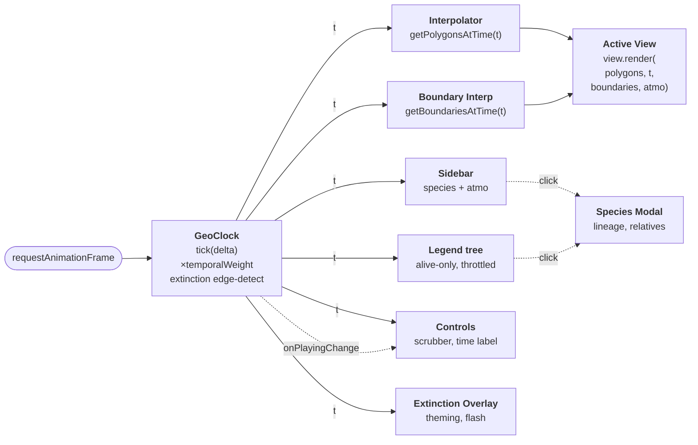
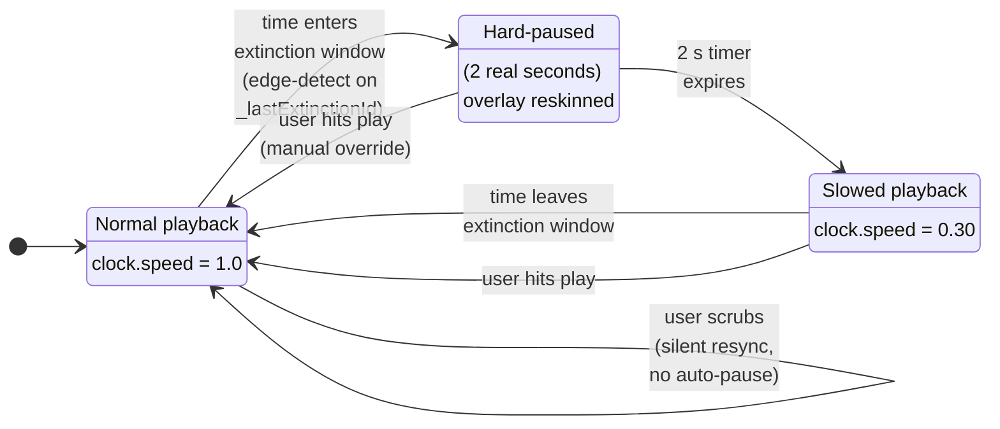
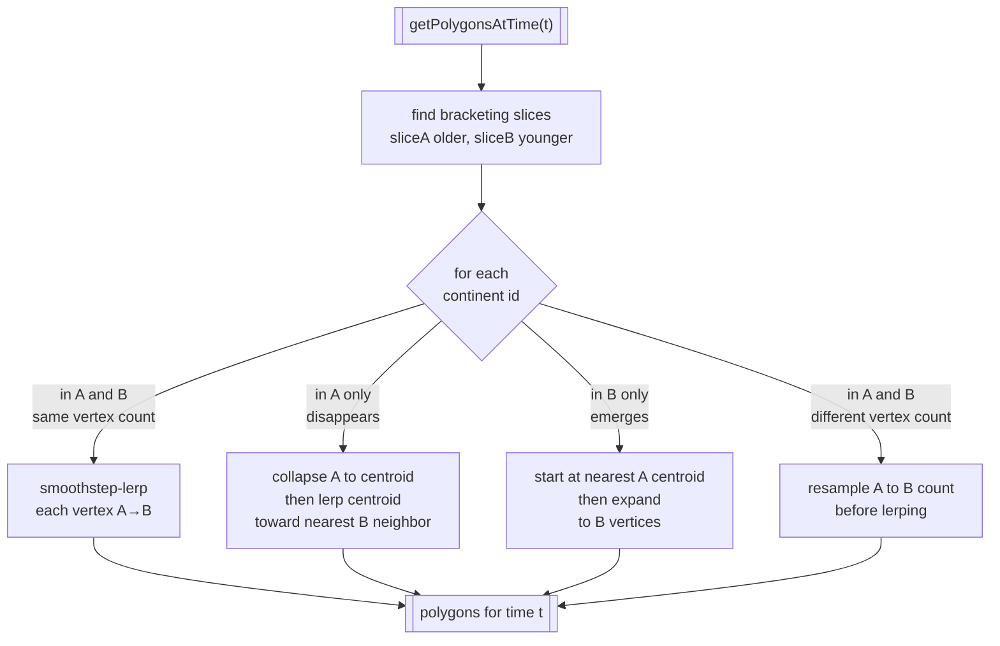
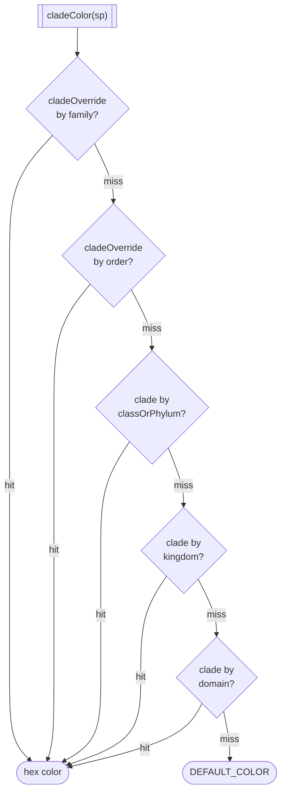
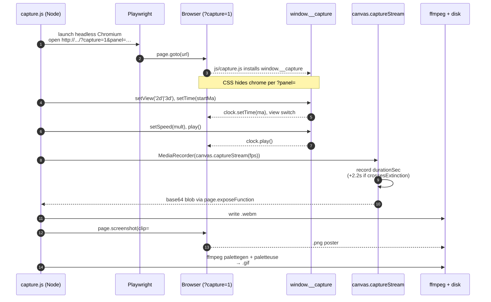

# Architecture

Vanilla HTML / CSS / ES modules. Three.js v0.170.0 loaded via CDN import map in `index.html`. No bundler. No framework. No npm dependencies for the runtime.

## Data flow

A single `requestAnimationFrame` loop in `js/main.js` drives the system. Each frame advances the clock (with period-weight compression), runs the interpolators, then hands the geometry to the active view while all UI components re-render against the updated time.



Per-frame sequence:

1. `clock.tick(delta)` advances `currentTimeMa` (counts **down**, past → present). The raw delta is multiplied by `getTemporalWeight(currentTimeMa)` from `js/data/timeline.js` so billions of years of single-celled stability pass quickly while diversification bursts linger.
2. `getPolygonsAtTime(t)` and `getBoundariesAtTime(t)` return interpolated geometry for the current time.
3. The active view (`View2D` or `View3D`) renders the scene.
4. `Sidebar`, `Controls`, `Legend`, `ExtinctionOverlay`, and `MilestoneOverlay` update their DOM from `t`. The Legend self-throttles (rebuilds every ~500 ms) and skips work entirely while hidden.

## Extinction auto-pause state machine

When the clock crosses into a Big Five extinction window, it **hard-pauses for 2 real seconds** so the overlay text is readable, then resumes at **30% of normal speed** for the rest of the window. The clock tracks the last-seen extinction id as edge state; transitions fire on entry and on expiry.



Implementation highlights (`js/engine/clock.js`):

- `_lastExtinctionId` holds the id of the extinction the last tick was inside (or `null`). A transition from `null` → some-id fires `_triggerExtinctionPause()`.
- `setTime()` silently syncs `_lastExtinctionId` so scrubbing *into* an extinction window does **not** auto-pause. Only forward-playing entry does.
- `onPlayingChange` fires when the clock flips `playing` on its own (e.g. the auto-pause / auto-resume). Manual `play()` / `pause()` / `togglePlay()` do **not** fire it — their callers already know they changed state.

## Continental interpolation

`js/engine/interpolator.js` walks from the lower-bound time slice to the upper-bound slice (12 slices from 4 Ga → present) and emits interpolated polygons for the current time. Three branches handle vertex-count mismatches and continent appearance/disappearance:



This is why supercontinent assembly and rifting look like smooth topology changes instead of vertex "snap" frames — continents that merge shrink toward each other via a shared centroid; continents that emerge grow out from nothing.

## Fractal coastline subdivision

`js/engine/fractal.js` adds visual detail to the interpolated polygon without jitter between frames. The algorithm recursively subdivides each edge, displacing the midpoint perpendicular to the edge by an amount **hashed deterministically** from the midpoint's coordinates — so the same coordinate yields the same displacement every frame, no matter what time we're at.

Schematic (one edge, three recursion levels):

```
level 0:   A ────────────────────── B

level 1:   A ─────── M₁ ─────── B
                     ↑ displaced ⊥ by hash(M₁.lon, M₁.lat)
                       × RENDER.fractalAmplitude
                       × cos(lat)        ← reduces jitter near poles

level 2:   A ── m  ── M₁ ── m  ── B
                 ↑           ↑
                 hash(m₁')   hash(m₂')

level 3:   A · m · m · M₁ · m · m · B      (24 segments total at depth 3)
```

Key properties:

- **Deterministic**: `hash(lon, lat)` is pure — the same coordinate always produces the same displacement. No per-frame jitter.
- **Latitude-corrected**: amplitude scales with `cos(lat)` so Arctic coasts don't get absurdly long displacements in the equirectangular projection.
- **Bounded depth**: controlled by `RENDER.fractalDepth` (default 3 → 8 segments per input edge).

After fractal subdivision, `view2d._tracePath()` traces the point list with quadratic Béziers through midpoints — so the result is a smooth curve, not a zig-zag.

## Taxonomy & color lookup

Every species in `js/data/species.js` carries a Linnaean `taxonomy` object (`domain → kingdom → classOrPhylum → order → family → genus → species`) and a `rank` field naming the most specific level the entry represents. Marker colors are resolved by a priority cascade in `js/util/taxonomy.js::cladeColor()`:



The override layer lets Primates (order) and Hominidae (family) punch up as visually distinct even though their `classOrPhylum` is the generic Mammalia. Everything else falls into a classOrPhylum bucket (Dinosauria, Aves, Synapsida, Arthropoda, Embryophyta, etc.), with kingdom and domain as last-resort fallbacks.

The same taxonomy drives:

- **Close relatives** (`speciesModal`) — ranked by `sharedRankDepth(a, b)` = the deepest rank at which both entries' non-null values match (7 = same species, 1 = same domain, 0 = unrelated). Temporal overlap tiebreaks.
- **Lineage ladder** (`speciesModal`) and **breadcrumb** (`speciesPopup`) — one row/segment per non-null rank, self-row highlighted.
- **Legend tree** (`legend.js`) — `<details>`/`<summary>` grouping of currently-alive species by domain → kingdom → classOrPhylum.
- **Rim-ring predicate** (`view2d.js`) — `hasRimRing(sp)` returns true when `classOrPhylum ∈ {Mammalia, Aves}` AND `order != null`, highlighting the fully-resolved warm-blooded radiation.

## Modules

### Engine

| Module | Responsibility |
|---|---|
| `js/engine/clock.js` | Time progression with temporal compression. Implements the **2-second extinction auto-pause** state machine above. Exposes `onPlayingChange` callback so external UI stays in sync. |
| `js/engine/interpolator.js` | Continental polygons between 12 time slices, with split/merge via centroid collapse/expand (see flowchart above). |
| `js/engine/plateBoundaryInterpolator.js` | Plate-boundary polylines between matching slices. |
| `js/engine/fractal.js` | Deterministic fractal coastline subdivision with coordinate-based hashing — no jitter during interpolation. |

### Views

| Module | Highlights |
|---|---|
| `js/views/view2d.js` | Smooth Bézier coastlines (`_tracePath()`), shaded relief (NW highlight + SE shadow clipped inside each polygon), enhanced graticule (emphasized equator/prime meridian + dashed tropics & polar circles), per-event extinction flash, K-Pg asteroid streak, marker halos with rim ring on advanced clades. |
| `js/views/view3d.js` | ACES Filmic tone mapping, MeshPhongMaterial with bright specular for sun glints, **Fresnel rim-glow atmosphere** (custom `ShaderMaterial`, additive blending), **procedural cloud shell** generated by `_buildCloudTexture()`, per-event ocean tint, additive marker halos. Lazy-loaded on first 3D toggle. |

### UI

| Module | Responsibility |
|---|---|
| `js/ui/sidebar.js` | Species list ranked by abundance + 5 atmosphere readouts (Temp, O₂, CO₂ with sparklines, Seismic, Biodiversity). Click hands off to `SpeciesModal`. |
| `js/ui/speciesModal.js` | Centered modal that pauses the clock on open, shows full detail, the 7-rank **lineage ladder**, and lineage-distance-ranked close relatives. Stays paused on close. |
| `js/ui/speciesPopup.js` | Hover-anchored quick-info card. Shows a compact lineage breadcrumb (`Eukarya › Animalia › Mammalia › …`). |
| `js/ui/controls.js` | Scrubber, play/pause, speed, restart, era strip, keyboard shortcuts. The scrubber inverts `clock.currentTimeMa` so left = past, right = present. Exposes `syncPlayButton()`. |
| `js/ui/extinctionOverlay.js` | Per-event theming: title color/glow, vignette gradient, subtitle color all derived from `extinction.color`. |
| `js/ui/milestoneOverlay.js` | Lighter top-center callouts for non-extinction milestones. |
| `js/ui/legend.js` | Toggleable legend: a live Linnaean tree (domain → kingdom → class/phylum → species) of currently-alive species, plus plate-boundary key. Uses native `<details>`/`<summary>` for collapse/expand; rebuilds throttled by `TIMING.legendUpdateIntervalMs`. |

### Data

| Module | Content |
|---|---|
| `js/data/timeline.js` | 26 geological periods with ICS colors and `temporalWeight` values |
| `js/data/continents.js` | 12 continental polygon time slices |
| `js/data/species.js` | 119 species with abundance profiles; merges Linnaean `taxonomy` + `rank` from `speciesTaxonomy.js` at load |
| `js/data/speciesTaxonomy.js` | Domain → species lineage for every entry, keyed by species id |
| `js/data/extinctions.js` | The Big Five with timing, severity, cause, signature color |
| `js/data/atmosphere.js` | Temperature, O₂, CO₂ curves |
| `js/data/seismicActivity.js` | Plate-tectonic intensity curve |
| `js/data/biodiversity.js` | Estimated species count helper |
| `js/data/glaciation.js` | Polar ice-cap extent driven by temperature |

See [docs/data-sources.md](data-sources.md) for the paleo references behind these.

### Utilities

- `js/util/colorMix.js` — `hexToRgb`, `mixColors`, `mixColorsRgba`, `clamp`
- `js/util/atmoVisual.js` — atmosphere snapshot → haze tint + latitude-keyed continent color sample
- `js/util/taxonomy.js` — `RANKS`, `cladeColor`, `lineageLabels`, `sharedRankDepth`, `relativesOf`, `hasRimRing`. Central hub for every taxonomy-derived display/scoring decision.

### Configuration

`js/config.js` holds every tunable constant: clade colors (keyed on `taxonomy.classOrPhylum` with order/family overrides), timing (base speed, slowdowns, the 2-second pause, legend throttle), render parameters (fractal depth, marker sizes, globe radius), layout, atmosphere haze parameters, glaciation thresholds, and the latitude-color palette.

## Capture pipeline

The screenshots and animated clips embedded in the README and `docs/sequences/` are produced by Playwright + ffmpeg. The capture script pilots the live application through `window.__capture`, recording the actual canvas pixels via `MediaRecorder` over `canvas.captureStream()`.



`window.__capture` surface:

```js
window.__capture = {
  setView('2d' | '3d'),
  setTime(ma),
  setSpeed(mult),
  play(), pause(),
  state(),                     // { timeMa, playing, speed, view }
  waitFor(predicate, timeoutMs),
  sleep(ms),
  activeCanvas(),              // for canvas.captureStream
};
```

Full pipeline reference: [scripts/capture/README.md](../scripts/capture/README.md). Troubleshooting and a mid-level overview: [docs/capture.md](capture.md).

## Renderer interface

Both views implement the same shape so `main.js` can switch between them without conditionals:

```js
view.init();                                           // create renderer + DOM
view.render(polygons, timeMa, boundaries, atmo);       // called every frame
view.resize();                                         // ResizeObserver
view.destroy();                                        // hide, keep state for reuse
view.onSpeciesHover(callback);                         // for the popup
```

The 3D view is lazy-loaded — its module isn't fetched until the user toggles the 3D button for the first time.
