# Notable sequences

Eleven moments worth pausing on. Each links to a detailed walkthrough with an embedded clip, an explainer, and a checklist of what to watch for.

The thumbnail PNGs and WebM/GIF clips are produced by `scripts/capture/capture.js` (see [docs/capture.md](capture.md)). On a fresh clone they may be absent — run `node scripts/capture/capture.js --all` from `scripts/capture/` to populate them.

| # | Poster | Time (Ma) | Sequence | Highlight |
|---|---|---|---|---|
| 1 | <a href="sequences/hadean.md"></a> | 4540 → 4000 | [Earth's Origin & Hadean](sequences/hadean.md) | Molten newborn planet, no continents, no life |
| 2 | <a href="sequences/goe.md"></a> | 2500 → 2200 | [Great Oxygenation Event](sequences/goe.md) | Cyanobacteria peak, methane haze clears |
| 3 | <a href="sequences/snowball.md">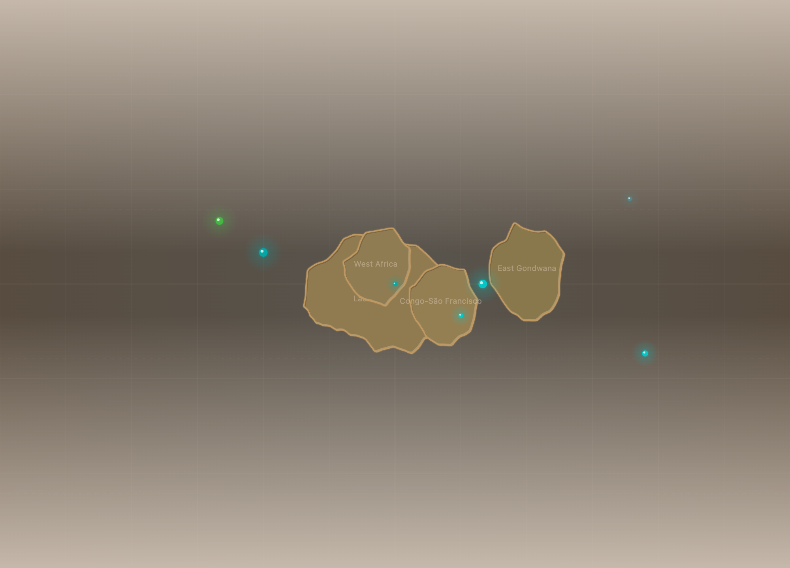</a> | 720 → 635 | [Snowball Earth](sequences/snowball.md) | Polar ice caps reach the equator |
| 4 | <a href="sequences/cambrian.md">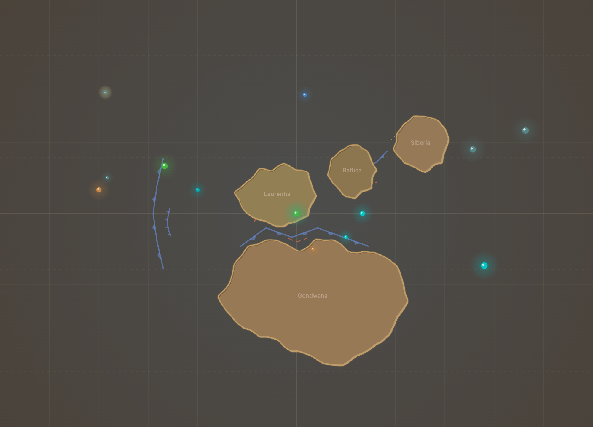</a> | 540 → 480 | [Cambrian Explosion](sequences/cambrian.md) | Body plans burst — sidebar fills with new clades |
| 5 | <a href="sequences/forests.md"></a> | 410 → 360 | [First Forests (Devonian)](sequences/forests.md) | Land turns green, fish crawl out |
| 6 | <a href="sequences/permian.md">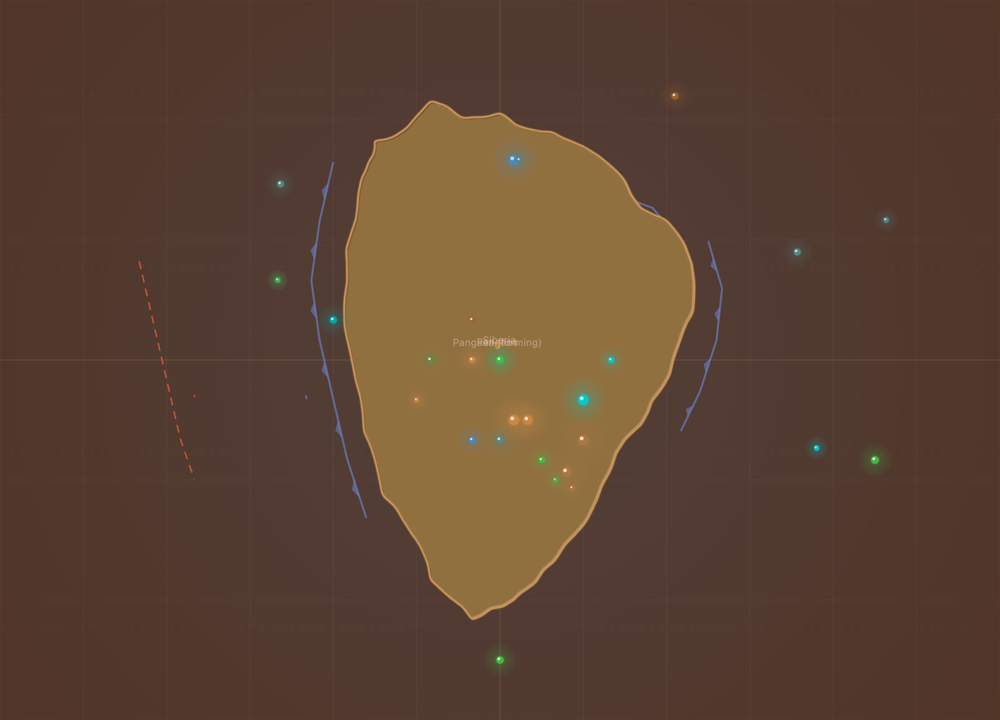</a> | 256 → 250 | [End-Permian "Great Dying"](sequences/permian.md) | 96% extinction; clock pauses on the overlay |
| 7 | <a href="sequences/jurassic.md">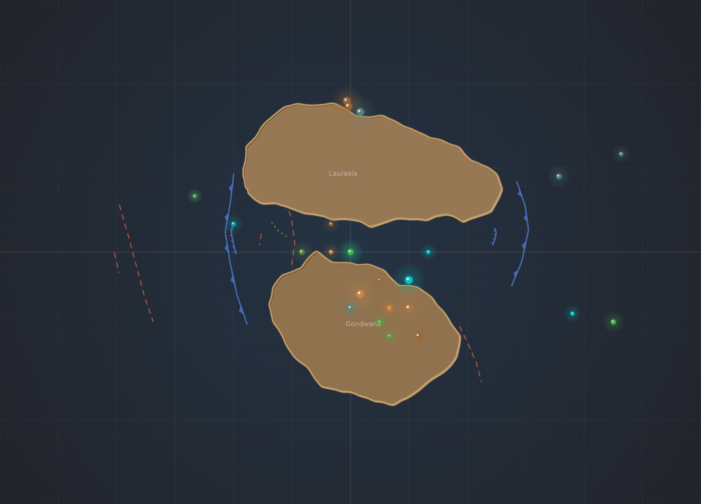</a> | 200 → 145 | [Jurassic Dinosaurs](sequences/jurassic.md) | Pangaea splits, peak dinosaur diversity |
| 8 | <a href="sequences/feathered.md">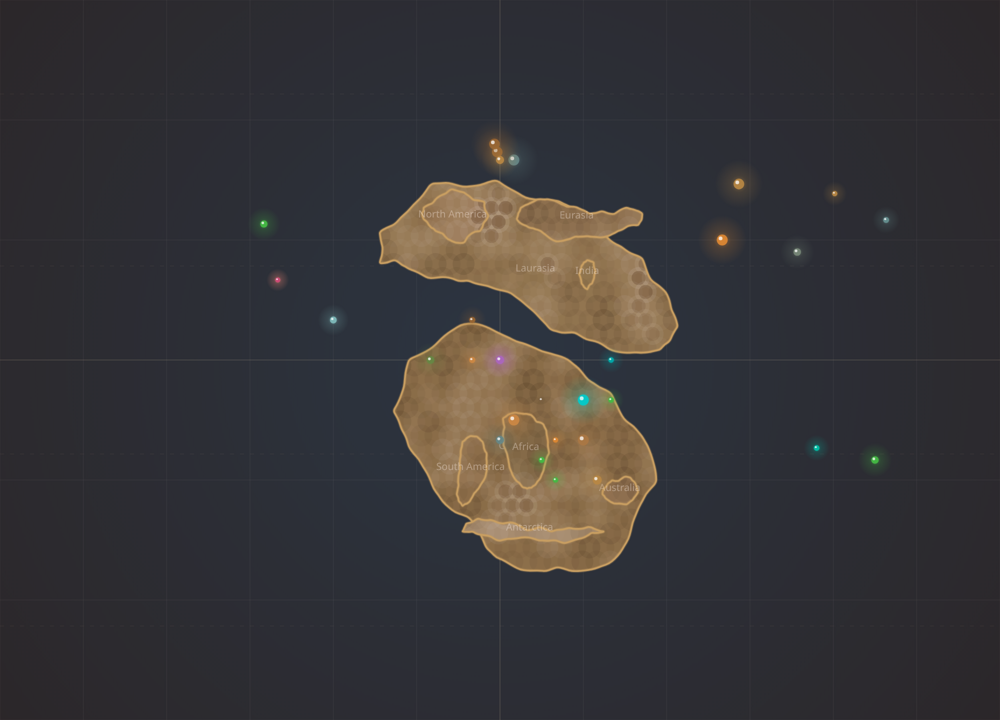</a> | 165 → 65 | [Feathered Dinosaurs & Dawn of Birds](sequences/feathered.md) | Tianyulong, Yi qi, Yutyrannus, Wulong, Asteriornis "Wonderchicken" |
| 9 | <a href="sequences/kpg.md">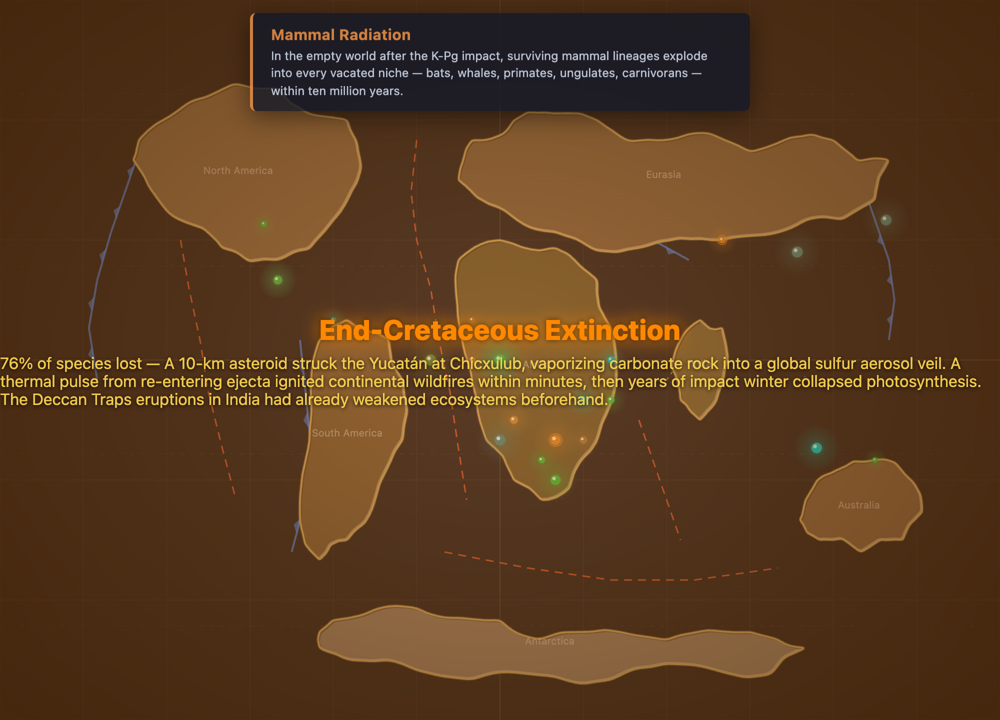</a> | 67 → 64 | [K-Pg Asteroid Impact](sequences/kpg.md) | Asteroid streak, dinosaurs vanish |
| 10 | <a href="sequences/pleistocene.md"></a> | 2.5 → 0.012 | [Ice Age & Megafauna](sequences/pleistocene.md) | Ice caps advance, mammoths and dire wolves |
| 11 | <a href="sequences/hominin.md">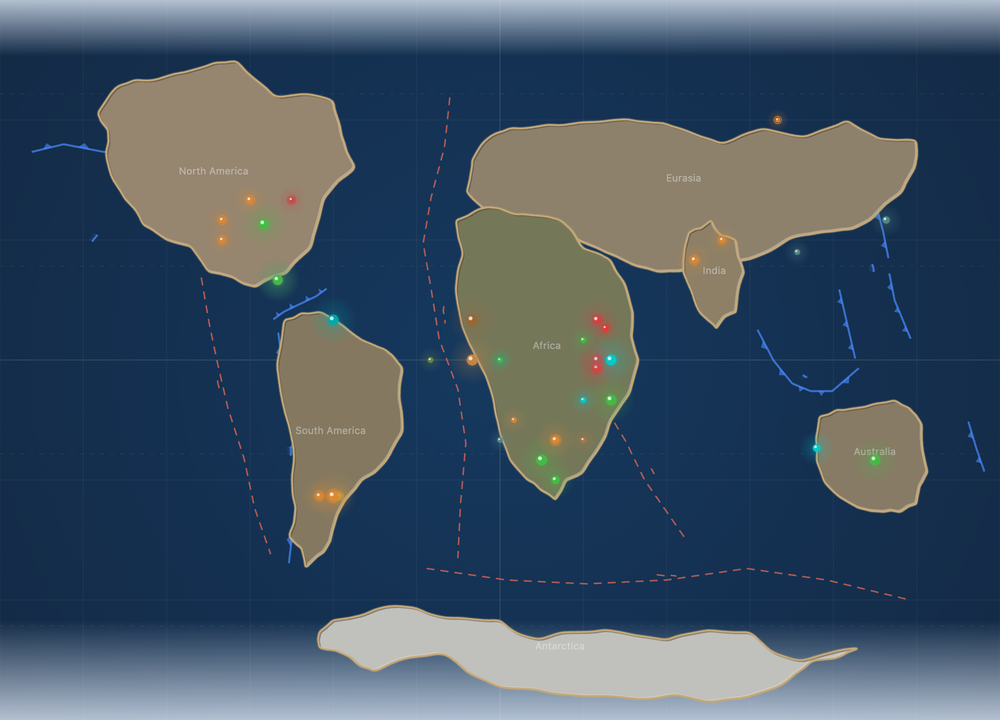</a> | 6 → 0 | [Hominin Emergence](sequences/hominin.md) | Sahelanthropus → erectus → Neanderthal/Denisovan/naledi/sapiens |

## Reading order

The list above is in chronological order. To get the full arc in one sitting, walk the table top-to-bottom — the play-through at 1× takes about 4 minutes 27 seconds end to end.

To dip in, the three highest-impact picks are **Cambrian**, **K-Pg**, and **Pleistocene** — they're embedded as the hero clips in the [main README](../README.md).

## Species detail modal — iconic highlights

The app opens a detail modal when you click any species in the sidebar — the clock pauses and the modal shows full metadata plus a computed list of close evolutionary relatives. These stills freeze that modal on five iconic species across the timeline:

<table>
  <tr>
    <td align="center">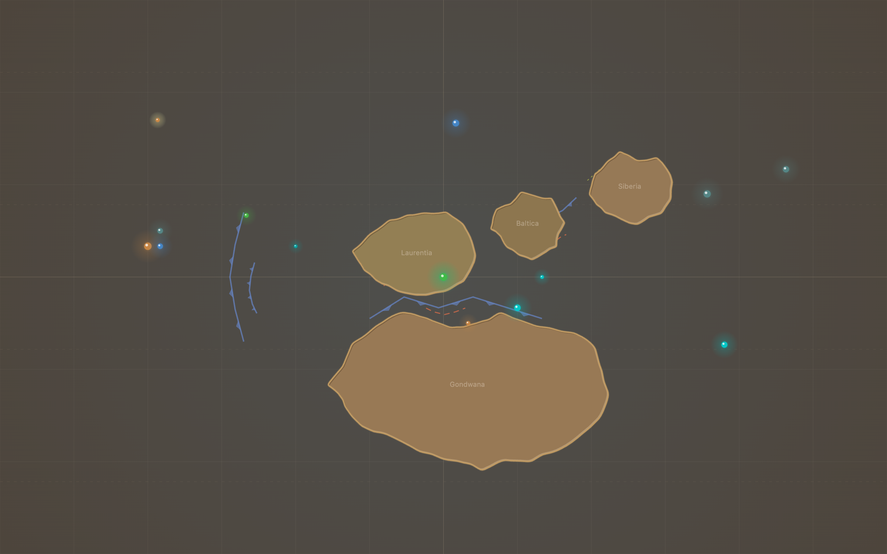<br/><sub><b>Trilobite</b> · 521 → 252 Ma</sub></td>
    <td align="center">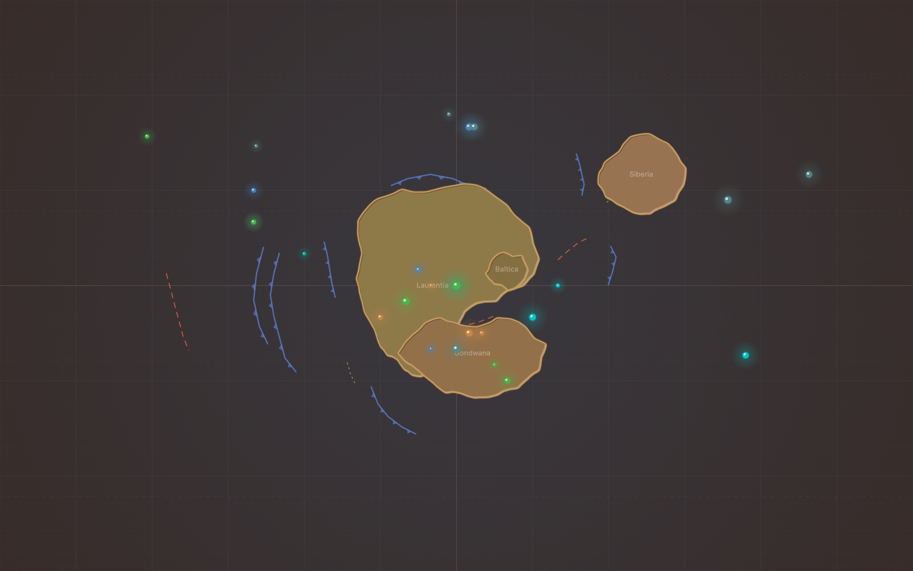<br/><sub><b>Tiktaalik</b> · 375 → 360 Ma</sub></td>
    <td align="center">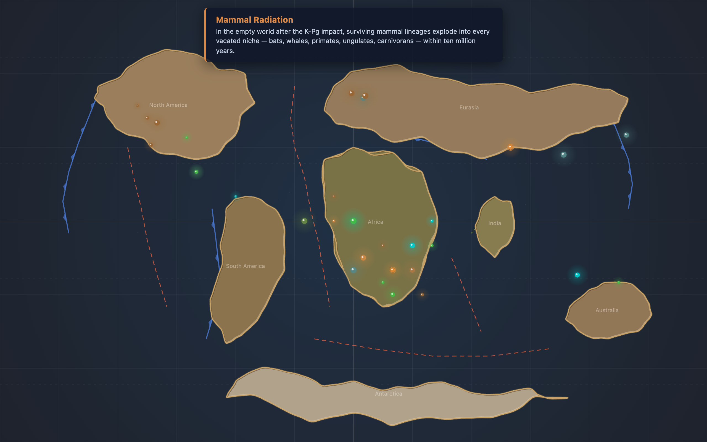<br/><sub><b>Tyrannosaurus rex</b> · 68 → 66 Ma</sub></td>
  </tr>
  <tr>
    <td align="center">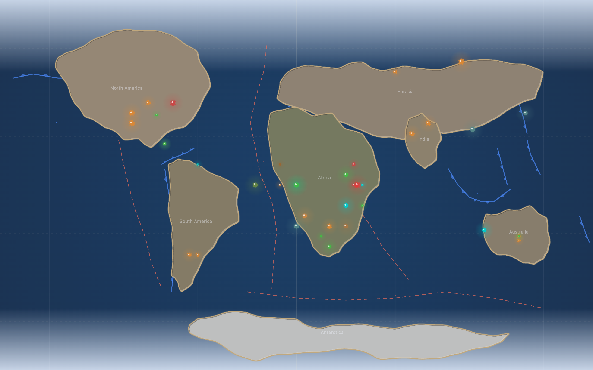<br/><sub><b>Woolly Mammoth</b> · Late Pleistocene</sub></td>
    <td align="center">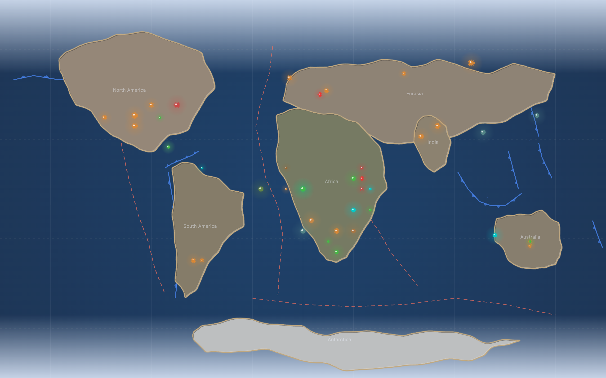<br/><sub><b>Homo sapiens</b> · 0.3 Ma → present</sub></td>
    <td></td>
  </tr>
</table>

Each modal shows the species' full description, time range, and a heuristic-ranked "Close relatives" list from the same category. Regenerate via:

```bash
cd scripts/capture
node capture.js --modals                      # all five
node capture.js --modal trilobite tiktaalik   # just these
```

## Capturing your own

Every walkthrough ends with the exact command to regenerate that clip. To re-capture them all:

```bash
cd scripts/capture
npm install                # one-time
node capture.js --all      # ~5 minutes (sequences)
node capture.js --modals   # ~30 seconds (modal stills)
```

See [docs/capture.md](capture.md) for full details.
