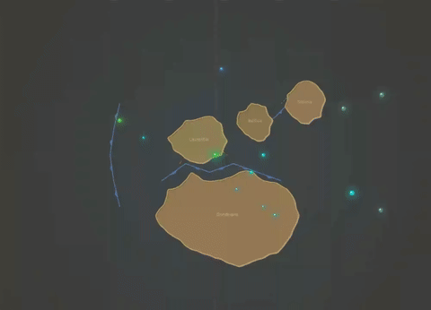

# Cambrian Explosion

**Time range:** 540 → 480 Ma  
**View:** 2D map (with sidebar)  
**Duration:** 12 seconds at 1× speed

<video src="../../assets/animations/04-cambrian.webm" autoplay loop muted playsinline width="800">
  
</video>

> Body plans burst onto the scene — the sidebar fills with new categories in seconds.

## Why it matters

In a geologically brief ~25 million years, virtually every animal phylum we still have today appears in the fossil record. Trilobites, brachiopods, mollusks, echinoderms, and the first chordates all show up — many with hard parts that fossilize easily, which is part of why the "explosion" looks so abrupt.

This is the moment evolution stops being chemistry-with-extra-steps and becomes recognizable life. From here onward, the sidebar is rarely empty.

## What to watch for

- **Sidebar** fills rapidly: trilobites, anomalocaris, hallucigenia, wiwaxia, marrella, ottoia, archaeocyatha, pikaia, and more — a cascade of new categories (arthropods, invertebrates, the first chordates).
- **Biodiversity readout** climbs sharply — this is the steepest single-period rise in the entire play-through.
- **Marker halos** of multiple colors crowd the map for the first time. Pulsing arthropod oranges and invertebrate teal-greys dominate.
- **Continents** are Gondwana + Laurentia, Baltica, Siberia — separated, with shallow tropical shelves where most of this evolution happens.
- **O₂ readout** continues climbing — the Cambrian benefits from Neoproterozoic oxygenation.

## Related data

- **Period:** Cambrian (538.8 → 485.4 Ma), `temporalWeight: 5.50` — near-peak weight, ~20 seconds of screen time.
- **Species:** the largest density of new entries in `js/data/species.js` covers this period.
- **Milestone overlay:** the Cambrian Explosion milestone fires at the start.

## Regenerate

```bash
cd scripts/capture
node capture.js cambrian
```
