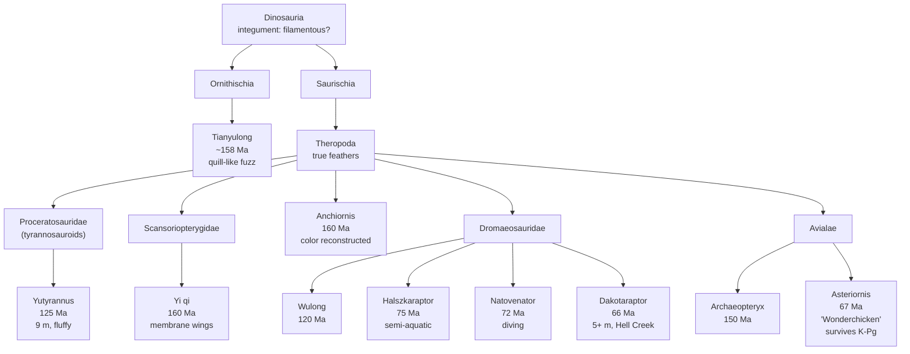

# Feathered Dinosaurs and the Dawn of Birds

**Time range:** 165 → 65 Ma
**View:** 2D map (with sidebar)
**Duration:** ~22 seconds at 1× speed


<video src="../../assets/animations/08-feathered.webm" autoplay loop muted playsinline width="800">
  
</video>

> A century of "scaly lizards" gives way to a hundred-million-year explosion of feathers, gliding membranes, and proto-birds — much of it discovered in the last 15 years.

> **Note:** Poster + clip files do not yet exist on disk. The sequence is registered with the capture pipeline (`scripts/capture/sequences.js`) — generate the assets with `cd scripts/capture && node capture.js feathered`. Until then, the `` / `<video>` tags above will render as broken — scrub the live app between the time anchors below.

## Why it matters

For most of the 20th century, dinosaurs were rendered as scaly reptiles and birds were treated as a separate evolutionary chapter that began with *Archaeopteryx* in 1861. In the 1990s, a flood of Chinese feathered theropods (Sinosauropteryx, Caudipteryx, Microraptor) began to dissolve that wall — and in the 2010s, a second wave of finds extended feathers across a much wider swath of the dinosaur tree, captured the *colors* of extinct plumage for the first time, and pushed the line between "non-avian dinosaur" and "bird" so close it almost vanishes.

This sequence walks the integumentary timeline from a fuzzy ornithischian (Tianyulong, suggesting feathers may be ancestral for *all* dinosaurs) through giant feathered tyrannosauroids (Yutyrannus), parallel flight experiments (Yi qi's bat-like membranes), an explosion of feathered dromaeosaurids (Wulong, Halszkaraptor, Natovenator, Dakotaraptor), the iconic Archaeopteryx, and finally to Asteriornis — the chicken-shaped seed of every modern bird, who survived the asteroid by days.

## Mechanism — feathered diversity through the Mesozoic



Body-covering filaments on Tianyulong (an ornithischian) imply that whatever protofeathers were, they go back to the base of Dinosauria — feathers are not a theropod novelty. From there, theropod feathers diversify into insulation (Yutyrannus), display (Wulong's tail plumes), aerodynamic surfaces (Microraptor, Anchiornis), and finally true wings (Avialae).

## What to watch for

- **Sidebar** — the dinosaur cluster keeps gaining new entries through the Cretaceous; the colors are mostly the warm Dinosauria orange (`#b88844`) but Yi qi sits in Scansoriopterygidae, Anchiornis in its own anchiornithid family, and Asteriornis switches to the cooler Aves yellow (`#ccaa33`).
- **Map markers** — concentrated in northeastern China (Yixian + Tiaojishan formations of Liaoning) for most of the Jurassic and Early Cretaceous, expanding to Mongolia (Halszkaraptor, Natovenator), Hell Creek (Dakotaraptor), and Belgium (Asteriornis) in the late Cretaceous.
- **Click any feathered dinosaur in the sidebar** to open the modal — the close-relatives panel will draw a clean ladder up through Theropoda → Coelurosauria → Maniraptora → Avialae as you progress through the clip.
- **K-Pg moment** — the visualization's auto-pause fires on the K-Pg extinction. Asteriornis sits *just* below the boundary in age (~67 Ma), then its descendants — every modern bird species — emerge on the other side.
- **Time-anchored callouts** below for the high-points of the lineage.

### Time-anchored callouts (~22 s clip)

| Clip time | Time-Ma window | UI detail to watch |
|---|---|---|
| 0 s – 4 s | 165 → 158 Ma | Tianyulong, Anchiornis, Yi qi, and Maiopatagium all appear in Liaoning — feathered/gliding diversity in the Tiaojishan biota; the gliding mammaliaform Maiopatagium shares the canopy |
| 4 s – 9 s | 158 → 125 Ma | Archaeopteryx (existing entry) appears at 150 Ma in Bavaria; Yutyrannus arrives at 125 Ma in Liaoning — biggest known feathered animal |
| 9 s – 14 s | 125 → 95 Ma | Wulong (120 Ma), Cretophasmomima leaf-mimic stick insects in the same beds; broader Cretaceous insectivore radiation |
| 14 s – 19 s | 95 → 70 Ma | Halszkaraptor and Natovenator show semi-aquatic dromaeosaurids in Mongolia; Mansourasaurus highlights the African Late Cretaceous |
| 19 s – 22 s | 70 → 65 Ma | Dakotaraptor in Hell Creek; Asteriornis ("Wonderchicken") at 67 Ma — the first modern crown bird, which crosses the K-Pg boundary that wipes out everything else |

## Related data

- **Feathered/avian entries** in `js/data/species.js`: Tianyulong, Anchiornis, Yi qi, Yutyrannus, Wulong, Halszkaraptor, Natovenator, Dakotaraptor, Archaeopteryx, Asteriornis (plus the existing Microraptor / other entries already present).
- **Periods covered:** Middle Jurassic, Late Jurassic, Early Cretaceous, Late Cretaceous.
- **Citations:** see `docs/data-sources.md` § "Recent-discovery additions" for primary references on each species named above.

## Regenerate

```bash
cd scripts/capture
node capture.js feathered
```

This produces `assets/screenshots/08-feathered.png`, `assets/animations/08-feathered.webm`, and `assets/animations/08-feathered.gif` — overwriting any existing copies. The sequence is registered as order 8 in `scripts/capture/sequences.js`; it crosses the K-Pg extinction at the very end so the runtime adds the standard 2.2 s buffer (`crossesExtinction: true`).
