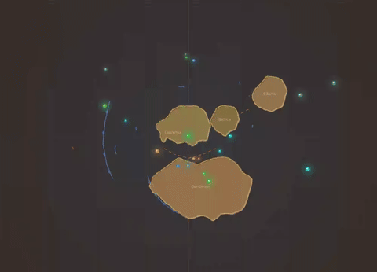

# First Forests (Devonian)

**Time range:** 410 → 360 Ma  
**View:** 2D map (with sidebar)  
**Duration:** 10 seconds at 1× speed

<video src="../../assets/animations/05-forests.webm" autoplay loop muted playsinline width="800">
  
</video>

> Land turns green, fish crawl out, oxygen surges as the first forests take hold.

## Why it matters

The Devonian is "the Age of Fishes" — but it's also when life conquered the land in a serious way. Cooksonia and other early vascular plants from the Silurian had been small and creeping; by the Devonian, **Archaeopteris** is forming the first real forests, with deep roots that crack rock and pull CO₂ from the atmosphere on a global scale.

Underwater, jawed fish (placoderms like Dunkleosteus, lobe-fins like Eusthenopteron) diversify spectacularly — and one lineage of lobe-fins, including transitional forms like **Tiktaalik**, takes the decisive step onto land. Amphibians appear by the Late Devonian.

## What to watch for

- **Sidebar** fills with new fish (Dunkleosteus, Eusthenopteron, lobe-fins) and the first plant entries (Archaeopteris, Cooksonia hold-overs).
- **O₂ readout** ramps up — first forests draw down CO₂ and pump out oxygen. By the late Devonian, O₂ is well above modern levels heading into the Carboniferous spike.
- **CO₂ readout** drops correspondingly.
- **Marker halos** cluster around shallow-coastal locations as marine life diversifies.
- The clip ends right around the **Late Devonian extinction** (372 Ma) — you may see the start of its 2-second auto-pause toward the end.

## Related data

- **Period:** Devonian (419.2 → 358.9 Ma), `temporalWeight: 5.00` — high weight, ~20 seconds of screen time.
- **Species added recently:** Archaeopteris, Eusthenopteron, Tiktaalik, Dunkleosteus, ammonoids, and more — see `js/data/species.js`.
- **Late Devonian extinction** (`extinctions.js#late-devonian`) sits at the end of this window.

## Regenerate

```bash
cd scripts/capture
node capture.js forests
```
