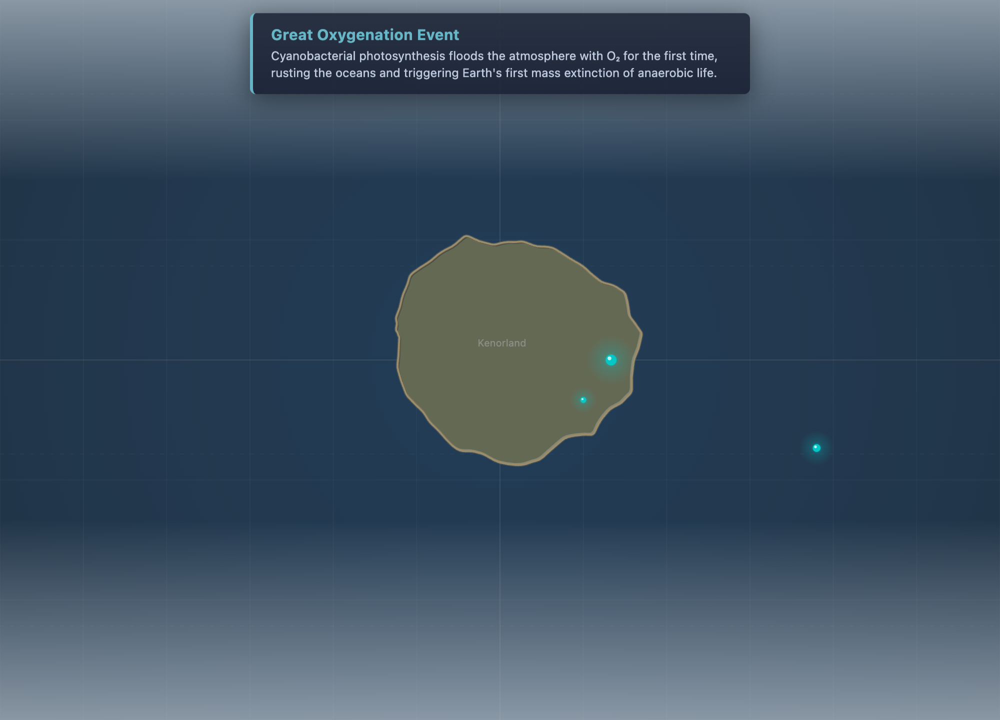
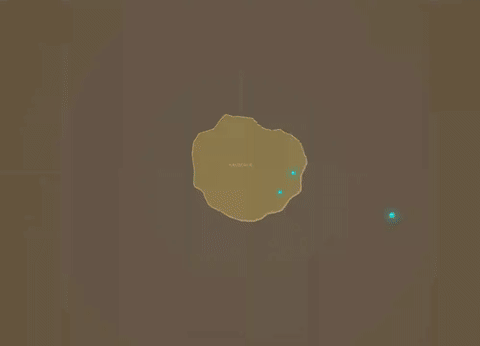
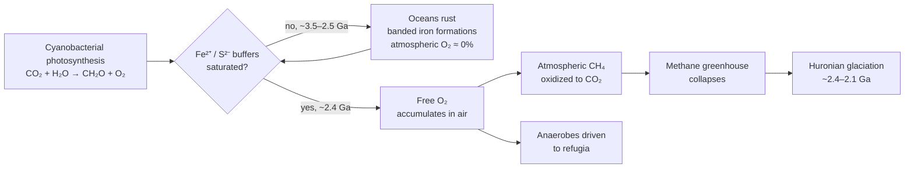

# Great Oxygenation Event

**Time range:** 2500 → 2200 Ma  
**View:** 2D map (with sidebar)  
**Duration:** 8 seconds at 1× speed



<video src="../../assets/animations/02-goe.webm" autoplay loop muted playsinline width="800">
  
</video>

> Cyanobacteria peak, the methane haze clears, and Earth's atmosphere irreversibly flips toward oxygen.

## Why it matters

The Great Oxygenation Event was the first global biosphere disaster — and the one that made every animal that would ever exist possible. Cyanobacteria had been quietly photosynthesizing for hundreds of millions of years before, but their O₂ output was being scrubbed by reduced minerals (iron, sulfide). Around 2.4 Ga those buffers saturated. Atmospheric O₂ rose, the methane greenhouse collapsed, and Earth slid into the **Huronian glaciation** — the first known global ice age.

For most of the existing biosphere, free oxygen was a poison. Anaerobic life retreated to mud, deep oceans, and gut interiors, where most of it still lives today.

## Mechanism



## What to watch for

- **O₂ readout** climbs visibly during the clip — from near-zero to a few percent.
- **CO₂ readout** drops as the methane greenhouse collapses.
- **Temperature** dips toward icehouse values by the end (the lead-up to Huronian glaciation).
- **Methane haze** in the visual atmosphere tint clears as low-O₂ greys give way to colder blues.
- **Sidebar** shows cyanobacteria peaking and other early life forms holding on.
- The continent at this time is mostly the Kenorland supercontinent, drifting near the equator.

### Time-anchored callouts (8 s clip)

| Clip time | Time-Ma window | UI detail to watch |
|---|---|---|
| 0 s – 3 s | 2500 → 2380 Ma | O₂ sparkline essentially flat near zero; CO₂ still very high; haze tint warm-brown |
| 3 s – 5 s | 2380 → 2300 Ma | O₂ inflection point — sparkline curves upward sharply; cyanobacteria/stromatolite rows rise in the sidebar abundance bar |
| 5 s – 8 s | 2300 → 2200 Ma | Temperature dips toward icehouse (lead-in to Huronian); haze shifts from warm to grey-blue; CO₂ drops visibly |

## Related data

- **Period:** Paleoproterozoic (2500 → 1600 Ma), `temporalWeight: 0.45` — boosted from default to give the GOE breathing room.
- **Atmosphere curves:** the O₂ inflection at ~2.4 Ga is the largest single jump in `js/data/atmosphere.js`.
- **Milestone overlay:** the Great Oxygenation Event milestone fires during this clip.

## Regenerate

```bash
cd scripts/capture
node capture.js goe
```
