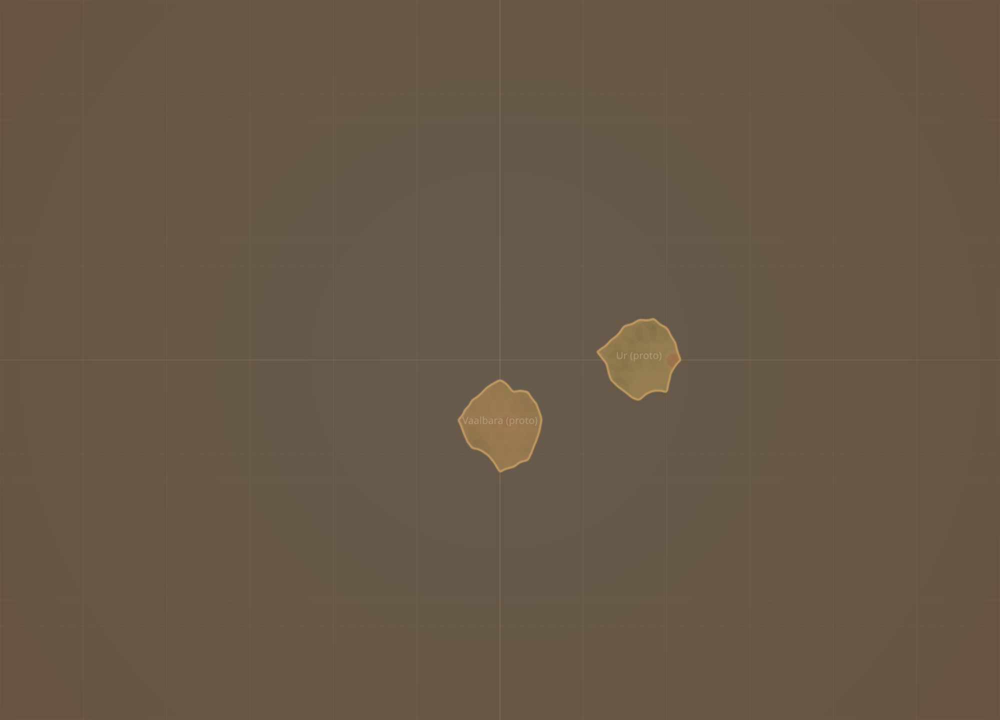
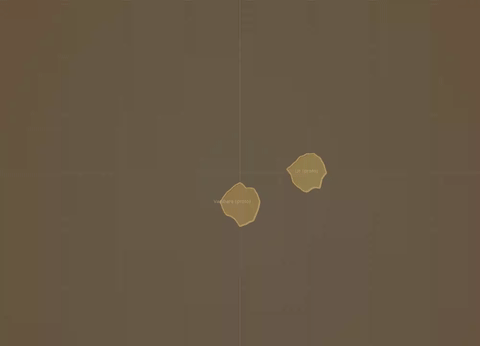
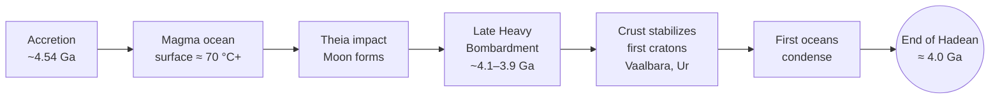

# Earth's Origin & Hadean

**Time range:** 4540 → 4000 Ma  
**View:** 2D map  
**Duration:** 6 seconds at 1× speed



<video src="../../assets/animations/01-hadean.webm" autoplay loop muted playsinline width="640">
  
</video>

> Molten newborn planet — no continents, no life, just a hot rock cooling under a young sun.

## Why it matters

The Hadean is the eon for which we have almost no rock record — it's defined more by what it lacked than what it contained. No continents to speak of, no stable oceans, no biosphere, no oxygen. The visualization compresses ~540 million years of magma-ocean cooling, late heavy bombardment, and the first appearance of continental crust into a brief opening sequence.

By the end of the Hadean (4000 Ma), the first cratons (Vaalbara and Ur) emerge as small grey dots on the globe — the seeds of every continent you'll watch drift over the next four minutes.

## Mechanism



## What to watch for

- **No species in the sidebar.** Life hasn't appeared yet.
- **No continents** — the 2D map is almost entirely deep-blue ocean, which is exactly the point; the first proto-cratons don't appear until the very end of the clip.
- **No plate overlay** — plate reconstructions this deep in time are speculative, so the overlay is intentionally off for Hadean.
- **Atmosphere readout:** temperature is off the charts (~70 °C surface), CO₂ is enormous (≥ 50,000 ppm), O₂ is essentially zero.
- **Seismic indicator:** Extreme. Plate tectonics — if it exists at all — is hyperactive.
- The sequence ends just as Vaalbara and Ur emerge from the magma ocean.

### Time-anchored callouts (6 s clip)

| Clip time | Time-Ma window | UI detail to watch |
|---|---|---|
| 0 s – 2 s | 4540 → 4350 Ma | Pure deep-ocean blue; sidebar empty; temp readout pegged high (~70 °C); CO₂ enormous |
| 2 s – 4 s | 4350 → 4150 Ma | Visual atmosphere haze is red-brown (hot greenhouse tint); seismic reads "Extreme" |
| 4 s – 6 s | 4150 → 4000 Ma | First grey proto-craton specks (Vaalbara, Ur) appear in the last second; temp has dropped noticeably |

## Related data

- **Period:** Hadean (4540 → 4000 Ma), `temporalWeight: 0.10` — flies by deliberately.
- **Atmosphere curves:** see `js/data/atmosphere.js` extreme low-Ma values.
- **Continents:** the very first slice in `js/data/continents.js` (4000 Ma) shows the proto-cratons that appear at the end of this clip.

## Regenerate

```bash
cd scripts/capture
node capture.js hadean
```
