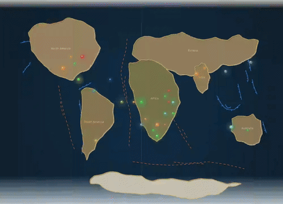

# Hominin Emergence

**Time range:** 6 → 0 Ma  
**View:** 2D map (with sidebar)  
**Duration:** 8 seconds at 1× speed

<video src="../../assets/animations/10-hominin.webm" autoplay loop muted playsinline width="800">
  
</video>

> Ardipithecus → Homo erectus → Neanderthals → Homo sapiens, on the heels of the megafauna.

## Why it matters

In a geological eyeblink — six million years, less than 0.2% of Earth's history — a single primate lineage evolves from chimp-like forest-edge apes into a globally dominant species that reshapes ecosystems on every continent.

The visualization tracks key hominin entries: **Ardipithecus** (early bipedal, ~4.4 Ma) → **Australopithecus** (e.g. Lucy, ~3 Ma) → **Homo habilis** → **Homo erectus** (the first long-distance global migrant, ~2 Ma) → **Homo neanderthalensis** (ice-age cousins, ~400 ka–40 ka) → **Homo sapiens** (us, ~300 ka onward). Each gets a distinct entry with its own appearance and (where applicable) extinction Ma.

Watch for the moment the sidebar shows multiple Homo species coexisting — there were periods, particularly in the Late Pleistocene, when at least four hominin species lived on Earth simultaneously.

## What to watch for

- **Sidebar** sees the full hominin sequence appear in order. The hominin category color (`#ee3333`) is distinctive.
- **Markers** appear concentrated in East Africa, then spread to Eurasia and beyond as Homo erectus migrates.
- **Megafauna entries** drop off the sidebar through the late Pleistocene — correlated in this dataset with hominin spread.
- **Holocene** (the very tail of the clip) lasts only 11,700 years — a single frame of "blink and miss it" agriculture and civilization.
- **Click any hominin entry** in the sidebar (in the live app) to open the modal and see close relatives — you'll get a clean walk through the lineage.

## Related data

- **Hominin entries** in `js/data/species.js`: Ardipithecus, Australopithecus, Homo habilis, Homo erectus, Homo neanderthalensis, Homo sapiens.
- **Period:** Pliocene + Pleistocene + Holocene cover this window.
- **Milestone overlay:** "Agriculture & Civilization" fires in the final fraction of a second.

## Regenerate

```bash
cd scripts/capture
node capture.js hominin
```
