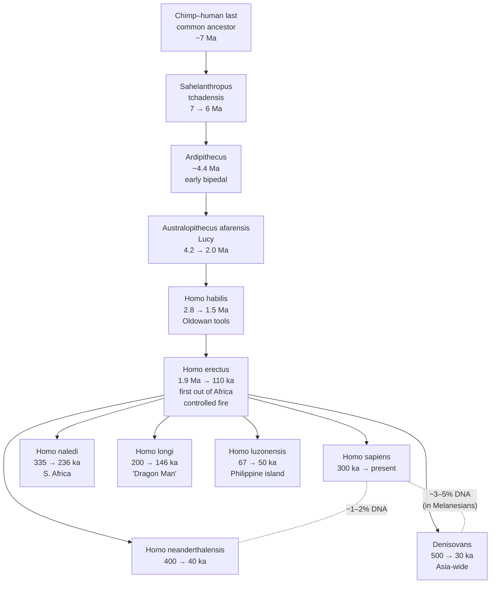

# Hominin Emergence

**Time range:** 6 → 0 Ma  
**View:** 2D map (with sidebar)  
**Duration:** 8 seconds at 1× speed


<video src="../../assets/animations/11-hominin.webm" autoplay loop muted playsinline width="800">
  
</video>

> Sahelanthropus → Australopithecus → Homo erectus → a Late Pleistocene crowd of Neanderthals, Denisovans, naledi, longi, luzonensis → sapiens — on the heels of the megafauna.

## Why it matters

In a geological eyeblink — six million years, less than 0.2% of Earth's history — a single primate lineage evolves from chimp-like forest-edge apes into a globally dominant species that reshapes ecosystems on every continent.

The visualization tracks key hominin entries: **Ardipithecus** (early bipedal, ~4.4 Ma) → **Australopithecus** (e.g. Lucy, ~3 Ma) → **Homo habilis** → **Homo erectus** (the first long-distance global migrant, ~2 Ma) → **Homo neanderthalensis** (ice-age cousins, ~400 ka–40 ka) → **Homo sapiens** (us, ~300 ka onward). Recent discoveries dramatically widen the late-Pleistocene picture: **Denisovans** (identified from genetics in 2010), **Homo naledi** (Rising Star Cave, 2015), **Homo longi** (Harbin "Dragon Man", 2021), and **Homo luzonensis** (Callao Cave, 2019). Each gets a distinct entry with its own appearance and (where applicable) extinction Ma.

Watch for the moment the sidebar shows multiple Homo species coexisting — by the Late Pleistocene at least *six* members of our genus walked the Earth at once across Africa, Eurasia, and island Southeast Asia.

## Mechanism — a simplified hominin phylogeny



Coexistence windows visible in the clip: Homo erectus overlaps with Neanderthals, Denisovans, and early Homo sapiens. The Late Pleistocene hosts at least **six Homo species simultaneously** — sapiens, neanderthalensis, denisovans, naledi, longi, and luzonensis — spread across Africa, Europe, Asia, and island Southeast Asia.

## What to watch for

- **Sidebar** sees the full hominin sequence appear in order. The hominin category color (`#ee3333`) is distinctive.
- **Markers** appear concentrated in East Africa, then spread to Eurasia and beyond as Homo erectus migrates.
- **Megafauna entries** drop off the sidebar through the late Pleistocene — correlated in this dataset with hominin spread.
- **Holocene** (the very tail of the clip) lasts only 11,700 years — a single frame of "blink and miss it" agriculture and civilization.
- **Click any hominin entry** in the sidebar (in the live app) to open the modal and see close relatives — you'll get a clean walk through the lineage.

### Time-anchored callouts (8 s clip)

| Clip time | Time-Ma window | UI detail to watch |
|---|---|---|
| 0 s – 2 s | 6 → 4 Ma | Sahelanthropus marker pulses in central Africa; first_monkeys / great_apes still dominating the primate band |
| 2 s – 4 s | 4 → 2 Ma | Australopithecus appears; East African markers multiply; the Hominidae family color (red override) becomes visible |
| 4 s – 6 s | 2 → 0.4 Ma | Homo habilis then Homo erectus rise; erectus markers spread from Africa to Eurasia (Java, Georgia); mammoth megafauna dominate sidebar simultaneously |
| 6 s – 8 s | 0.4 Ma → 0 | **Up to six Homo species coexist**: Neanderthals (Europe/W. Asia), Denisovans (Siberia/E. Asia), Homo naledi (S. Africa), Homo longi (NE China), Homo luzonensis (Philippines), and rising Homo sapiens. Then Neanderthals, Denisovans, longi, naledi, luzonensis all drop in succession; Homo sapiens (deep red, `#ee3333`) takes the #1 slot; Agriculture & Civilization milestone fires in the final fraction of a second |

## Related data

- **Hominin entries** in `js/data/species.js`: Sahelanthropus, Ardipithecus, Australopithecus, Homo habilis, Homo erectus, Homo neanderthalensis, Homo sapiens, Denisovans, Homo naledi, Homo longi, Homo luzonensis.
- **Period:** Pliocene + Pleistocene + Holocene cover this window.
- **Milestone overlay:** "Agriculture & Civilization" fires in the final fraction of a second.

## Regenerate

```bash
cd scripts/capture
node capture.js hominin
```
