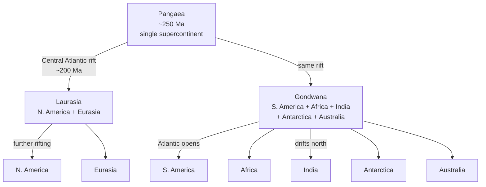
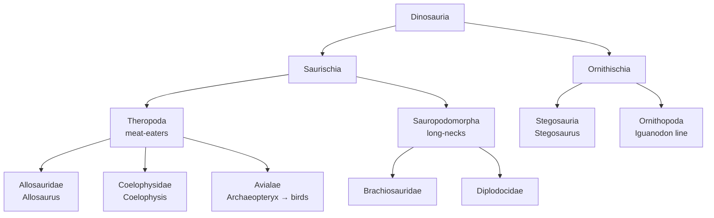

# Jurassic Dinosaurs

**Time range:** 200 → 145 Ma  
**View:** 2D map (with plate overlay)  
**Duration:** 10 seconds at 1× speed


<video src="../../assets/animations/07-jurassic.webm" autoplay loop muted playsinline width="640">
  
</video>

> Pangaea splits, oceans flood the gaps, and dinosaur diversity reaches its peak.

## Why it matters

The Jurassic is when dinosaurs become the unambiguous dominant terrestrial vertebrates. Synapsids (the lineage that survived to give us mammals) are pushed to nocturnal small-bodied roles. Sauropods (Brachiosaurus, Diplodocus) become the largest land animals to ever exist. Theropods (Allosaurus and kin) take the apex predator slots. Birds appear from one branch of small theropods (Archaeopteryx).

Geographically, **Pangaea is splitting**. The Central Atlantic opens, then the South Atlantic begins to spread. The opening Tethys Ocean separates Laurasia from Gondwana. Climate is warm and humid worldwide — no polar ice caps.

## Mechanism — two linked stories

### Continents: Pangaea → Laurasia + Gondwana



### Dinosaur radiation (Saurischia + Ornithischia)



Parallel, off-the-Dinosauria branches flourishing in the same clip: **Pterosauria** (Pterodactylus) in the air, **Ichthyosauria** + **Plesiosauria** in the seas.

## What to watch for

- **Pangaea visibly splits under the plate overlay** — divergent ridges (orange-red dashed) open in the Central Atlantic, transform offsets (yellow-green) jog along the Pacific margin, and convergent teeth (blue, with tick marks) form the subduction zones along the active coasts.
- **Continents** drift noticeably during the clip — Pangaea is mid-rift.
- **No polar ice caps** — temperature is well above the warm threshold so glaciation is suppressed.
- **Sidebar** features Brachiosaurus, Diplodocus, Stegosaurus, Allosaurus, Pterodactylus, Ichthyosaurs, and Plesiosaurs.
- **Marker halos** cluster across multiple continents as dinosaurs spread before the breakup completes.

### Time-anchored callouts (10 s clip)

| Clip time | Time-Ma window | UI detail to watch |
|---|---|---|
| 0 s – 3 s | 200 → 180 Ma | Pangaea still mostly one mass; plate overlay shows Central Atlantic rift opening (orange-red dashed) |
| 3 s – 6 s | 180 → 160 Ma | Sauropods (Brachiosaurus, Diplodocus) and theropods (Allosaurus) fill the sidebar; Ichthyosaurs + Plesiosaurs in seas |
| 6 s – 9 s | 160 → 150 Ma | Stegosaurus peaks; Archaeopteryx appears (its own color — Aves) as the feathered-flight branch |
| 9 s – 10 s | 150 → 145 Ma | Pangaea clearly split into two; Gondwana + Laurasia distinct with a widening Tethys |

## Related data

- **Period:** Jurassic (201.4 → 145 Ma), `temporalWeight: 5.50` — peak weight, ~20 seconds of screen time at 1×.
- **Atmosphere:** the Jurassic warm-greenhouse signature (high CO₂, no ice) tints the 3D shell toward warm hues.
- **Continents:** the 200 Ma and 150 Ma reconstructions in `js/data/continents.js` bracket this clip.

## Regenerate

```bash
cd scripts/capture
node capture.js jurassic
```
