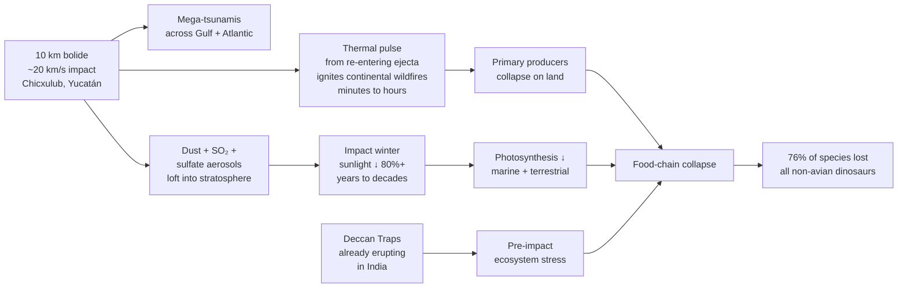

# K-Pg Asteroid Impact

**Time range:** 67 → 64 Ma  
**View:** 2D map (with sidebar)  
**Duration:** 7 seconds at 1× speed (plus 2 s auto-pause)


<video src="../../assets/animations/09-kpg.webm" autoplay loop muted playsinline width="800">
  
</video>

> A 10-km asteroid streaks across the sky and the non-avian dinosaurs vanish from the sidebar.

## Why it matters

Sixty-six million years ago, a 10-km asteroid struck the Yucatán at Chicxulub. The thermal pulse from re-entering ejecta ignited continental wildfires within minutes. Years of impact winter collapsed photosynthesis. Combined with the already-stressed ecosystems weakened by the Deccan Traps eruptions in India, the result was the end of the non-avian dinosaurs — and the opening of the Cenozoic mammal radiation.

It's the most famous extinction in the popular imagination, and the only one with a single, clearly identified, instantaneous trigger event.

## Mechanism — impact to extinction in <5 years



## What to watch for

- **Asteroid streak** — a bright diagonal flash sweeps across the canvas during the first ~18% of the extinction's progress. Watch the upper-left for the entry point.
- **2-second hard pause** the instant the clock crosses into the K-Pg window. The overlay reads "End-Cretaceous Extinction — K-Pg Event" with an orange tint (`extinction.color = #ff8800`).
- **Ocean tint** shifts toward dark orange-red.
- **Sidebar exodus**: Tyrannosaurus, Triceratops, Velociraptor, Quetzalcoatlus, Mosasaurus, Pterosaurs, and the rest of the dinosaur entries fall off the top-15 within a couple of frames as their abundance profiles drop to zero. Recent additions in the same window are also wiped out: **Dakotaraptor** (the 5+ m feathered Hell Creek raptor, 2015), **Mansourasaurus** (a rare African Late Cretaceous titanosaur, 2018), **Natovenator** (the diving Mongolian dromaeosaurid, 2022), and the gondwanatherian mammals **Vintana** + **Adalatherium** of Madagascar.
- **The bird that survives**: **Asteriornis** ("Wonderchicken", named 2020 from Belgium) sits at 67 Ma — the first known modern crown bird, ancestral to today's chickens, ducks, and ratites. Its descendants are essentially all that's left of Dinosauria after the boundary.
- **Continents** are recognizably modern in arrangement — seven distinct landmasses, India still racing north.

### Time-anchored callouts (7 s clip + 2 s auto-pause)

| Clip time | Time-Ma window | UI detail to watch |
|---|---|---|
| 0 s – 1 s | 67 → 66.3 Ma | Full dinosaur sidebar: Tyrannosaurus, Triceratops, Velociraptor, Ankylosaurus, Parasaurolophus, Mosasaurus, Quetzalcoatlus, Dakotaraptor, Mansourasaurus, Natovenator, Vintana, Adalatherium; Asteriornis ("Wonderchicken") pulses on Belgian shoreline as a small Aves marker |
| 1 s – 3 s | ≈ 66 Ma | **Clock crosses extinction window → 2 s hard pause**; overlay re-skins orange (`#ff8800`); a **bright diagonal streak** draws top-left during the first ~18% of progress |
| 3 s – 5 s | 66 → 65.7 Ma | Screen shake; ocean tints orange-red; dinosaur rows drop out of the sidebar in quick succession |
| 5 s – 9 s | 65.7 → 64 Ma | Post-extinction quiet; mammal rows rise (Placental Mammals, stem lineages); first primates appear later in play-through |

## Related data

- **Extinction:** `extinctions.js#end-cretaceous`, severity 76%, duration 0.1 Ma — the shortest of the Big Five.
- **Asteroid streak rendering:** `js/views/view2d.js`, in the extinction-flash block — only fires for `extinction.id === 'end-cretaceous' && extinction.progress < 0.18`.
- **Affected groups:** all non-avian dinosaurs in the dataset are flagged in `affectedGroups`.

## Regenerate

```bash
cd scripts/capture
node capture.js kpg
```
