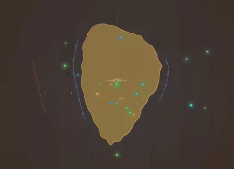
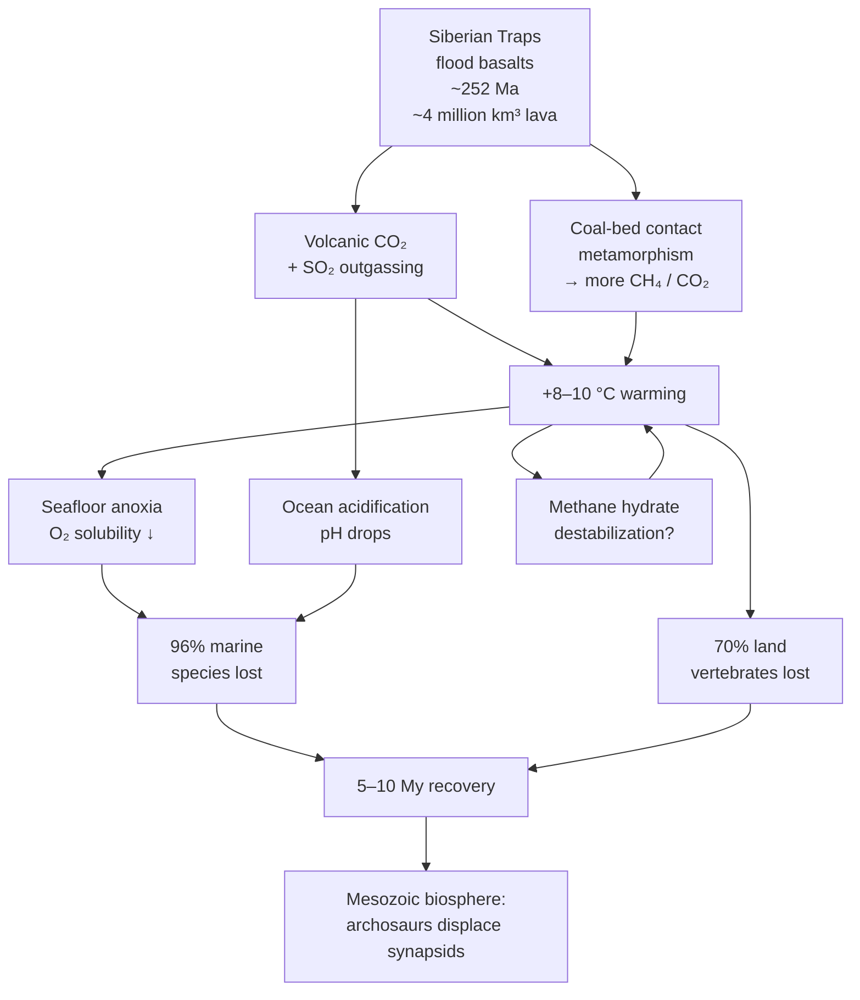

# End-Permian "Great Dying"

**Time range:** 256 → 250 Ma  
**View:** 2D map (with sidebar)  
**Duration:** 8 seconds at 1× speed (plus 2 s auto-pause)


<video src="../../assets/animations/06-permian.webm" autoplay loop muted playsinline width="800">
  
</video>

> The worst extinction in the rock record — 96% of marine species lost in under a million years.

## Why it matters

The end-Permian extinction is the closest the planet has ever come to total sterilization. Million-year flood-basalt eruptions of the **Siberian Traps** vented enormous CO₂ and SO₂, warming the climate by 8–10 °C. Ocean acidification, near-total seafloor anoxia, and possibly methane hydrate destabilization combined into a runaway greenhouse.

96% of marine species and 70% of land vertebrates disappeared. The recovery took 5–10 million years, and the Mesozoic biosphere that emerged on the other side was fundamentally different — synapsids (mammal ancestors) lost their dominance to archosaurs (dinosaur ancestors) for the next 180 million years.

## Mechanism — the Siberian Traps cascade



## What to watch for

- **2-second hard pause** the moment the clock crosses into the extinction window — the play button flips to ▶ and the overlay reads "End-Permian Extinction — The Great Dying" so you can read it.
- **Ocean color** shifts toward a darker red (the per-event tint uses `extinction.color = #ff2222`).
- **Title color** in the overlay matches; vignette and subtitle pick up the same red.
- **Screen shake** kicks in proportional to severity and progress — this is the most violent shake of the whole play-through.
- **Sidebar** loses entries as Permian synapsids (Dimetrodon, Edaphosaurus, gorgonopsids) drop out.
- **Pangaea** dominates the map — a single supercontinent, with the disappearing Tethys Sea on the right.

### Time-anchored callouts (8 s clip + 2 s auto-pause)

| Clip time | Time-Ma window | UI detail to watch |
|---|---|---|
| 0 s – 2 s | 256 → 253 Ma | Full Pangaea; sidebar packed with Permian synapsids (Dimetrodon, Gorgonopsia, Therapsids) |
| 2 s – 4 s | ≈ 252 Ma | Clock crosses extinction threshold → **2 s hard pause**; overlay reads "End-Permian Extinction — The Great Dying" in signature red; play button flips to ▶ |
| 4 s – 7 s | 252 → 251 Ma | Screen shake peaks; ocean tints dark red; synapsid sidebar rows drop off; playback is 0.30× |
| 7 s – 10 s | 251 → 250 Ma | Lystrosaurus surges (post-extinction opportunist); sidebar is sparse; the Mesozoic world emerges |

## Related data

- **Extinction:** `extinctions.js#end-permian`, severity 96%, duration 0.5 Ma.
- **Period weight:** Permian was deliberately *lowered* from 1.8 → 3.20 in the latest tuning so end-Permian compounding stays watchable rather than stalling.
- **Pause length:** `TIMING.extinctionPauseSeconds = 2` in `js/config.js`.

## Regenerate

```bash
cd scripts/capture
node capture.js permian
```
