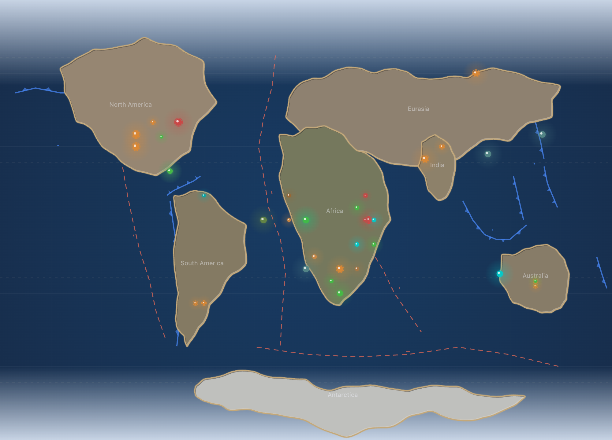
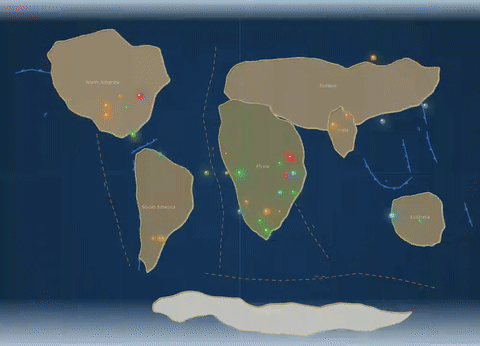
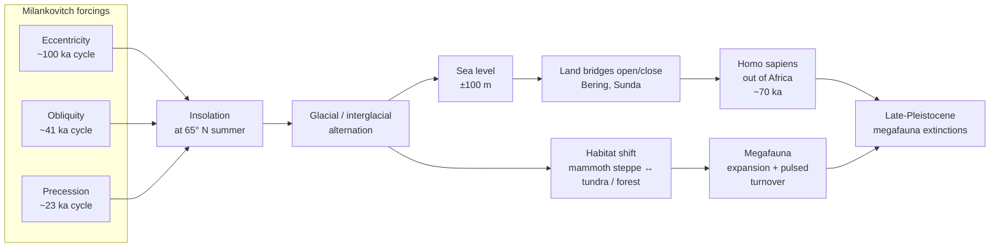

# Ice Age & Megafauna

**Time range:** 2.5 → 0.012 Ma  
**View:** 2D map (with sidebar)  
**Duration:** 9 seconds at 1× speed



<video src="../../assets/animations/10-pleistocene.webm" autoplay loop muted playsinline width="800">
  
</video>

> Polar caps expand, mammoths and dire wolves spread across continents reshaped by ice.

## Why it matters

The Pleistocene is the recent ice age — over 40 cycles of glacial advance and retreat over the past 2.6 million years. Sea levels rose and fell by 100+ meters. North America and northern Europe were repeatedly buried under continental ice sheets. In the warm interglacials, life adapted; in the colds, it migrated, evolved cold-tolerance, or perished.

The megafauna of the Pleistocene — woolly mammoths, woolly rhinos, giant ground sloths, dire wolves, sabertooth cats, cave bears, short-faced bears — were the largest mammals to walk on land since the demise of the dinosaurs. Most of them disappear in a wave of late-Pleistocene extinctions correlated with the spread of *Homo sapiens* out of Africa.

## Mechanism — orbital cycles driving ice and megafauna turnover



## What to watch for

- **Polar ice caps** expand to their maximum extent of the post-K-Pg world — the equator-pole gradient on the 2D map's polar-circle dashed lines becomes filled with ice.
- **Sidebar** is dominated by megafauna: Woolly mammoth, Woolly rhino, Smilodon, Megatherium, Dire wolf, Cave bear, Andrewsarchus.
- **Hominin entries** appear in the bottom of the sidebar — Homo erectus, Neanderthals, and finally early Homo sapiens. Recent additions also light up the Asia/Africa map: **Denisovans** (a sister group to Neanderthals identified from genetics in 2010 at Denisova Cave, Siberia), **Homo naledi** (the small-brained Rising Star Cave hominin, 2015), **Homo longi** ("Dragon Man," Harbin, 2021), and **Homo luzonensis** (the Philippine island hominin, 2019). At one point in the late Pleistocene the planet hosts five or more Homo species simultaneously.
- **Pleistocene** has the highest `temporalWeight` (10.00) in the entire timeline — it gets the most screen-time-per-Ma of any period, deliberately, since this is where most viewers want to linger.
- **Continents** are essentially modern — but you can see Britain joined to Europe and the Bering land bridge open, since sea levels are low.

### Time-anchored callouts (9 s clip)

| Clip time | Time-Ma window | UI detail to watch |
|---|---|---|
| 0 s – 2 s | 2.5 → 2.0 Ma | Polar caps already extending; Glyptodon, Megatherium appear in the sidebar |
| 2 s – 5 s | 2.0 → 1.0 Ma | Mammoth markers fill northern Eurasia; Homo erectus leaves Africa (markers spread east); ice caps pulse with temperature sparkline |
| 5 s – 8 s | 1.0 → 0.1 Ma | Peak megafauna: Smilodon, Dire Wolf, Woolly Rhino, Cave Bear, Irish Elk all simultaneously in the sidebar; Neanderthals, then Homo sapiens enter |
| 8 s – 9 s | 0.1 → 0.012 Ma | Megafauna rows collapse; Homo sapiens stays at top; clip ends at the Pleistocene/Holocene boundary |

## Related data

- **Period:** Pleistocene (2.58 → 0.0117 Ma), `temporalWeight: 10.00` — the ceiling.
- **Megafauna species** all live in this narrow window in `js/data/species.js`.
- **Glaciation extent** scales with the temperature curve which dips repeatedly through the Pleistocene cycles.

## Regenerate

```bash
cd scripts/capture
node capture.js pleistocene
```
