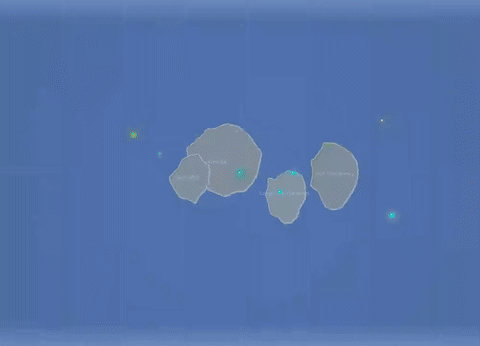
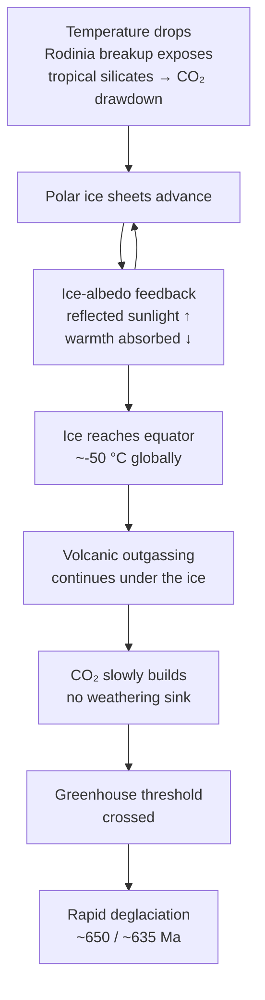

# Snowball Earth

**Time range:** 720 → 635 Ma  
**View:** 2D map  
**Duration:** 8 seconds at 1× speed


<video src="../../assets/animations/03-snowball.webm" autoplay loop muted playsinline width="640">
  
</video>

> Polar ice caps reach the equator — a blue-and-white planet during the Cryogenian glaciations.

## Why it matters

During the Cryogenian, Earth froze hard. The Sturtian (~717–660 Ma) and Marinoan (~650–635 Ma) glaciations probably took the ice cover all the way to (or near) the equator — the most extreme climate state in the planet's history. The Snowball-Earth hypothesis explains widespread tropical glacial deposits and the carbon-isotope anomalies that flank them.

Whatever the precise extent, this was the prelude to the Cambrian. Some hypotheses link the post-glaciation nutrient flush and oxygen rise directly to the explosion of complex life that follows in the next 100 million years.

## Mechanism



## What to watch for

- **Polar ice caps** bleed inward from the top and bottom of the 2D map — the polar-circle dashed lines fill with ice and push down toward the equator as temperature crashes. Cap opacity is driven by the temperature curve.
- **Temperature readout** crashes toward -5 °C.
- **Atmosphere haze** shifts toward icy blue.
- **Continents** are fragments of the breaking-up Rodinia supercontinent.
- **Plate overlay off** for this sequence — late-Proterozoic boundary reconstructions are still being debated; we leave the map uncluttered so the ice advance is the visual story.
- **Sidebar** is sparse — early eukaryotes are around but the sidebar's top-15 stays in the algal/single-cell band.

### Time-anchored callouts (8 s clip)

| Clip time | Time-Ma window | UI detail to watch |
|---|---|---|
| 0 s – 2 s | 720 → 700 Ma | Temp reads well above freezing; polar caps modest; Rodinia still fragmenting |
| 2 s – 5 s | 700 → 670 Ma | Temperature sparkline plunges; cap opacity grows; caps cross the tropic circle dashed lines |
| 5 s – 8 s | 670 → 635 Ma | Caps are near-equatorial; haze tint pale blue; temperature near -5 °C — planetary minimum |

## Related data

- **Period:** Cryogenian-Snowball (720 → 635 Ma), `temporalWeight: 1.00` — the highest weight in the Proterozoic, deliberately to slow this dramatic moment.
- **Glaciation:** the temperature curve dictates ice extent via `js/data/glaciation.js` and the `GLACIATION` config.
- **Milestone overlay:** the Snowball Earth milestone fires during this clip.

## Regenerate

```bash
cd scripts/capture
node capture.js snowball
```
